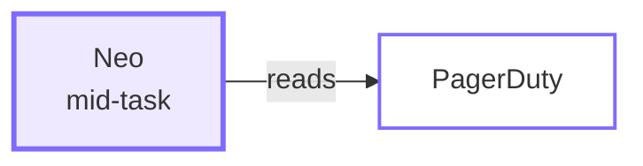
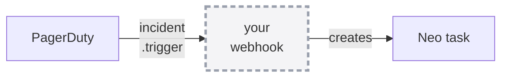

<div class="absolute inset-0 flex flex-col justify-center items-start px-20">
  <h1 class="!text-[5.4rem] !leading-[1.04] !font-semibold !tracking-tight !mb-6 !max-w-[95%]">
    Extending Pulumi Neo
  </h1>
  <p class="!mt-2 !text-[2.1rem] text-[var(--p-fg-muted)] !m-0 !leading-relaxed">
    MCP servers and cloud CLIs — giving Neo the systems your incidents live in
  </p>
  <p class="!mt-4 !text-[1.6rem] text-[var(--p-fg-muted)] !m-0 !leading-relaxed">
    Part 1 of 2 · part 2 with Engin Diri, Sep 30
  </p>
  <p class="!mt-6 !text-[1.8rem] text-[var(--p-fg-muted)] !m-0 !leading-relaxed">
    Adam Gordon Bell · Engin Diri · Pulumi
  </p>
</div>


---

<div class="absolute inset-0 flex items-center px-24 gap-20">
  <div class="flex-shrink-0">
    
  </div>
  <div class="flex-1">
    <h1 class="!text-[7rem] !leading-[1.02] !font-semibold !tracking-tight !mb-4 !text-[var(--p-primary)]">Adam Gordon Bell</h1>
    <p class="!text-[2.5rem] !leading-relaxed !m-0 opacity-90">
      Community Engineer at <strong class="!text-[var(--p-primary)]">Pulumi</strong>
    </p>
    <div class="!mt-8 flex items-center gap-8 !text-[1.5rem] opacity-70">
      <span class="flex items-center gap-2"><carbon-logo-x /> @adamgordonbell</span>
      <span class="flex items-center gap-2"><carbon-logo-linkedin /> adamgordonbell</span>
      <span class="flex items-center gap-2"><carbon-logo-github /> adamgordonbell</span>
    </div>
    <p class="!mt-10 !text-[1.75rem] !leading-relaxed opacity-70 !m-0">
      Host of the CoRecursive podcast.<br/>
      Telling the stories behind the code.
    </p>
  </div>
</div>


---

<div class="absolute inset-0 flex items-center px-24 gap-20">
  <div class="flex-shrink-0">
    
  </div>
  <div class="flex-1">
    <h1 class="!text-[7rem] !leading-[1.02] !font-semibold !tracking-tight !mb-4 !text-[var(--p-primary)]">Engin Diri</h1>
    <p class="!text-[2.5rem] !leading-relaxed !m-0 opacity-90">
      Senior Solutions Architect at <strong class="!text-[var(--p-primary)]">Pulumi</strong>
    </p>
    <div class="!mt-8 flex items-center gap-8 !text-[1.5rem] opacity-70">
      <span class="flex items-center gap-2"><carbon-logo-x /> @_ediri</span>
      <span class="flex items-center gap-2"><carbon-logo-linkedin /> engin-diri</span>
      <span class="flex items-center gap-2"><carbon-logo-github /> dirien</span>
    </div>
    <p class="!mt-10 !text-[1.75rem] !leading-relaxed opacity-70 !m-0">
      Building platform tooling and infrastructure-as-code.<br/>
      Helping teams ship cloud infrastructure faster. With and without agents.
    </p>
  </div>
</div>


---

# Housekeeping

<div class="zoom-content">

<ul class="!mt-8 !text-[1.6rem] !leading-relaxed space-y-5">
  <li>I'll <strong>present and demo</strong> — nothing to follow along with</li>
  <li>Ask questions <strong>any time</strong>; treat this as a conversation</li>
  <li>Links go home with you — QR codes at the end</li>
</ul>

</div>

<style scoped>
.zoom-content { zoom: 1.7; }
</style>


---

# What Neo is

<div class="zoom-content">

<p class="!mt-6 !text-[1.7rem] !leading-relaxed">
Pulumi's own <strong>infrastructure agent</strong>. It reads your organization's
live state in Pulumi Cloud — your programs, your stacks, what's actually running.
</p>

<p class="!mt-7 !text-[1.7rem] !leading-relaxed">
Ask it something, and depending on what you asked it will
<strong>answer</strong>, <strong>investigate</strong>, <strong>review a change</strong>,
or <strong>open a pull request</strong> against your IaC.
</p>

<p class="!mt-7 !text-[1.7rem] !leading-relaxed opacity-85">
The result is not a console click but a diff, with a preview, that your reviewers still gate.
</p>

</div>

<style scoped>
.zoom-content { zoom: 1.25; }
</style>

<!--
Neo is an infrastructure agent. Announced Sep 2025, heavily used since. It reads your Pulumi and hands back a PR a human merges.
-->

---

# Day two

<div class="zoom-content">

<p class="!mt-6 !text-[1.7rem] !leading-relaxed">
<strong>Day one</strong> is standing it up: the tutorial, the first <code>pulumi up</code>,
the green check.
</p>

<p class="!mt-7 !text-[1.7rem] !leading-relaxed">
<strong>Day two</strong> is every day after that: the alert at 2am, the provider that
went out of date, the security group somebody added by hand and never mentioned,
the upgrade nobody has time for.
</p>

<p class="!mt-7 !text-[1.7rem] !leading-relaxed !text-[var(--p-primary)] !font-semibold">
Day one makes a good demo. Day two is a job, and it is what the rest of this hour is about.
</p>

</div>

<style scoped>
.zoom-content { zoom: 1.22; }
</style>

<!--
And that makes it great at day two, where the hard work is and where state, preview, and a reviewable diff already earn their keep.
-->

---

# You can go and play with this

<div class="zoom-content">

<p class="!mt-6 !text-[1.7rem] !leading-relaxed">
Neo is <strong>on by default</strong> in Pulumi Cloud. Settings &rarr; Neo Settings.
If you have an org, you already have it.
</p>

<p class="!mt-7 !text-[1.7rem] !leading-relaxed">
Point it at a stack you already have and ask it something you actually want to know.
</p>

<p class="!mt-7 !text-[1.6rem] !leading-relaxed opacity-85">
This part is fun. Everything I show today started as me poking at it.
</p>

</div>

<div class="flex justify-center items-center gap-8 !mt-6">
  
  <p class="!text-[1.5rem] !font-semibold !m-0">app.pulumi.com</p>
</div>

<style scoped>
.zoom-content { zoom: 1.25; }
</style>

<!--
Therefore try it out now. It is on in your org already.
-->

---
routeAlias: stage-map
---

# Three questions, and that's the hour

<div class="map3 !mt-8">

  <Link to="stage-knows" class="mcard-link">
    <div class="mcard">
      <div class="mnum">1</div>
      <div class="mname">what it knows</div>
      <div class="mbody">
        Your code, your stacks, and your state, and now, as one queryable graph,
        the resources <strong>nothing in Pulumi manages</strong>.
      </div>
      <div class="mgo" aria-hidden="true">&rarr; jump</div>
    </div>
  </Link>

  <Link to="stage-reaches" class="mcard-link">
    <div class="mcard">
      <div class="mnum">2</div>
      <div class="mname">what it can reach</div>
      <div class="mbody">
        <strong>Out</strong> to the systems you operate with: MCP, and the cloud CLIs.<br/>
        <strong>In</strong> from where you work: GitHub, Slack.
      </div>
      <div class="mgo" aria-hidden="true">&rarr; jump</div>
    </div>
  </Link>

  <Link to="stage-runs" class="mcard-link">
    <div class="mcard">
      <div class="mnum">3</div>
      <div class="mname">where it runs</div>
      <div class="mbody">
        Pulumi Cloud, your terminal, your editor, and
        <strong>on a schedule</strong>, with nobody there.
      </div>
      <div class="mgo" aria-hidden="true">&rarr; jump</div>
    </div>
  </Link>

</div>

<p class="!mt-8 !text-[1.45rem] text-center opacity-85">
The title is about the second question. The first and third show how far it now reaches.
</p>

<StageMap size="lg" />

<style scoped>
.map3 {
  display: grid;
  grid-template-columns: repeat(3, 1fr);
  gap: 1.5rem;
}
/* Each box jumps to its section. The whole card is the target, so it works
   from the back of the room with a trackpad and not just on the small
   corner strip. */
.mcard-link {
  display: block;
  text-decoration: none;
  color: inherit;
  border-radius: 14px;
}
.mcard {
  position: relative;
  display: flex;
  flex-direction: column;
  height: 100%;
  border: 2px solid color-mix(in oklch, var(--p-primary) 42%, transparent);
  border-radius: 14px;
  padding: 1.6rem 1.3rem 1.1rem;
  transition: border-color .18s, transform .18s, background .18s;
}
.mcard-link:hover .mcard {
  border-color: var(--p-primary);
  background: color-mix(in oklch, var(--p-primary) 9%, transparent);
  transform: translateY(-2px);
}
/* The affordance is a word plus an arrow — no colour-only cue. */
.mgo {
  margin-top: auto;
  padding-top: 0.9rem;
  font-family: var(--slidev-font-mono, ui-monospace, monospace);
  font-size: 0.92rem;
  letter-spacing: 0.08em;
  text-transform: uppercase;
  opacity: 0.4;
  transition: opacity .18s;
}
.mcard-link:hover .mgo { opacity: 0.95; color: var(--p-primary); }
.mnum {
  position: absolute;
  top: -1.05rem;
  left: 1.2rem;
  width: 2.1rem;
  height: 2.1rem;
  border-radius: 999px;
  background: var(--p-fg, #111);
  color: #fff;
  font-size: 1.2rem;
  font-weight: 700;
  display: flex;
  align-items: center;
  justify-content: center;
}
.mname {
  font-family: var(--slidev-font-mono, ui-monospace, monospace);
  font-size: 1.5rem;
  font-weight: 700;
  color: var(--p-primary);
  letter-spacing: 0.02em;
  margin-bottom: 0.85rem;
}
.mbody { font-size: 1.24rem; line-height: 1.6; opacity: 0.9; }
</style>

<!--
And it keeps getting new features. Today covers some of them in three categories: what it knows, what it can reach, where it runs.
-->

---
layout: section
routeAlias: stage-knows
---

# what it knows

## your code, your stacks, your state — and what that missed

<StageMap size="lg" />

<!--
First category: what it knows.
-->

---

# Neo already knew what Pulumi knew

<div class="zoom-content">

<p class="!mt-10 !text-[1.7rem] !leading-relaxed">
It could read your programs, your stacks, and your state, and it could write a
change, preview it, and deploy it.
</p>

<p class="!mt-8 !text-[1.7rem] !leading-relaxed opacity-85">
What it couldn’t see was everything Pulumi doesn’t record: the alert in PagerDuty,
the ticket in Linear, the metric in Datadog, and the parts of your cloud account
<strong>Pulumi doesn’t manage</strong>.
</p>

<p class="!mt-8 !text-[1.7rem] !leading-relaxed">
So a human read three consoles, and <em>then</em> asked for the change.
</p>

</div>

<style scoped>
.zoom-content { zoom: 1.4; }
</style>

<!--
Neo already knew what Pulumi knew: your programs, your stacks, your state. But most of your cloud is not in there. Pulumi's records stop at what Pulumi manages, and the security group somebody added by hand is not in any program.
-->

---

# The Context API: one graph over all of it

<p class="!mt-8 !text-[1.6rem] !leading-relaxed">Shipped last week: one queryable graph over state, stack dependencies, and the resources Discovery finds <strong>outside IaC entirely</strong>. Neo uses it out of the box.</p>

<div class="flex justify-center !mt-6">
  
</div>

<div class="demo-foot !mt-5">
  <DemoCta href="https://www.pulumi.com/blog/pulumi-context-api/" label="Read the launch post" />
</div>

<!--
So Neo now has one graph over the whole account, including what nothing manages. The Context API, shipped last week.
-->

---
layout: statement
class: demo
---

# Demo: one query against my org <DemoBadge kind="live" />

<div class="demo-foot demo-foot-xl">
  <DemoCta href="https://app.pulumi.com/adamgordonbell-org/insights" label="Open Insights" />
</div>

<!--
Here is one query against my own org.
-->

---

# 90% of that account is not Pulumi

<div class="flex justify-center gap-20 !mt-10">
  <div class="text-center">
    <div class="text-[5.5rem] leading-none font-bold" style="color: var(--p-primary)">1305</div>
    <div class="!mt-3 text-[1.5rem] opacity-80">found by cloud scan,<br/>no IaC tool</div>
  </div>
  <div class="text-center">
    <div class="text-[5.5rem] leading-none font-bold opacity-60">144</div>
    <div class="!mt-3 text-[1.5rem] opacity-80">managed by<br/>Pulumi</div>
  </div>
</div>

<p class="!mt-10 !text-[1.6rem] !leading-relaxed text-center">One query against my own org, this morning.</p>

<!--
Ninety percent of that account is not Pulumi. 1305 resources no IaC tool claims, against 144 in Pulumi. Neo can now reason about all of it. That is the first category.
-->

---
layout: section
routeAlias: stage-reaches
---

# what it can reach

## out to your tools, in from where you work

<StageMap size="lg" />

<!--
Second category: what it can reach.
-->

---
layout: two-cols
---

::header::

# Two directions

::left::

<div class="!mt-6">
<div class="!text-[1.55rem] !font-semibold opacity-60 !mb-2">OUT — to the systems you operate with</div>
<div class="!text-[2.1rem] !font-semibold !text-[var(--p-primary)]">MCP &nbsp;·&nbsp; Cloud CLI</div>

<p class="!mt-5 !text-[1.4rem] !leading-relaxed opacity-85">
<strong>MCP</strong> — PagerDuty · Linear · Datadog · Honeycomb · Atlassian · Supabase.
Pulumi Cloud holds the credentials, encrypted per org.
</p>

<p class="!mt-5 !text-[1.4rem] !leading-relaxed opacity-85">
<strong>Cloud CLI</strong> — <code>aws</code> · <code>gcloud</code> · <code>az</code> ·
<code>kubectl</code>. You hold the credentials, in Pulumi ESC.
</p>

<p class="!mt-5 !text-[1.4rem] !leading-relaxed !text-[var(--p-primary)] !font-semibold">
Both of today's demos live here.
</p>
</div>

::right::

<div class="!mt-6">
<div class="!text-[1.55rem] !font-semibold opacity-60 !mb-2">IN — from where you already work</div>
<div class="!text-[2.1rem] !font-semibold !text-[var(--p-primary)]">GitHub &nbsp;·&nbsp; Slack</div>

<p class="!mt-5 !text-[1.4rem] !leading-relaxed opacity-85">
Mention Neo in a PR thread or a channel and a task starts — without opening
Pulumi Cloud at all.
</p>

<p class="!mt-5 !text-[1.4rem] !leading-relaxed opacity-85">
This is a different question from the left-hand side. It is not about
<em>what Neo can see</em>, but about <em>how the work gets started</em>.
</p>
</div>

<!--
Neo could already reach out through Pulumi itself: preview, deploy, open a PR. Now it can touch the other surfaces too. Out, to the MCP servers and the cloud CLIs. In, from GitHub and Slack.
-->

---
hide: true
---

# It’s a toggle

<p class="!mt-4 !text-[1.6rem] !leading-relaxed">Under Settings → Integrations there are six of them, each with an <strong>Authorize</strong> button.</p>

<div class="flex justify-center !mt-6">
  
</div>

<!--
- An org admin turns one on, and that is the whole setup step.
- What used to be a webhook service, a deployment, and a pile of glue code is now a row in a list.
-->

---
layout: statement
hide: true
---

# Every demo today ends the same way

<p class="!mt-8 !text-[3.4rem] !font-semibold !text-[var(--p-primary)]">a reviewable pull request</p>

<p class="!mt-6 !text-[2rem] text-[var(--p-fg-muted)]">Neo proposes. A human merges.</p>

<div class="demo-foot !mt-10">
  <DemoCta href="https://github.com/adamgordonbell/neo-examples/pull/7" label="A real one: neo-examples #7" />
</div>

<!--
- Every demo today ends the same way, with a reviewable pull request. Neo proposes, and a human merges.
- The button opens a real merged PR. Neo removed three unused resources it found: an EBS volume for a database that no longer exists, an ALB with no listeners, and a security group for an absent API Gateway. The body says what each one was and why it was safe to delete.
- Because the output is always a PR, Neo never needed write access to the cloud. That comes back in the scope section.
-->

---
layout: section
routeAlias: stage-ask
hide: true
---

# ask

## you hand it a ticket, it hands back a pull request

<StageMap size="lg" />

---

# There are tickets in your backlog nobody is getting to

<p class="!mt-2 !text-[1.5rem] text-[var(--p-fg-muted)]">They matter, but they never win the morning. What if you could just hand one over?</p>

<div class="queue">

<div class="queue-col">
  <div class="queue-label">wins the morning</div>
  <div class="tkt hot">SEV-2 · checkout 500s</div>
  <div class="tkt hot">Customer escalation</div>
  <div class="tkt hot">Release cut</div>
</div>

<div class="queue-col">
  <div class="queue-label">never urgent, never done</div>
  <div class="tkt cold">Bump the provider version</div>
  <div class="tkt cold">Centralize that secret</div>
  <div class="tkt cold">Close a policy violation</div>
  <div class="tkt cold">Narrow an over-broad IAM role</div>
  <div class="tkt cold">Tag the untagged resources</div>
</div>

</div>

<style scoped>
.queue { display: flex; gap: 4.5rem; justify-content: center; margin-top: 2.4rem; }
.queue-col { display: flex; flex-direction: column; gap: 0.85rem; width: 24rem; }
.queue-label {
  font-size: 1.15rem; font-weight: 600; letter-spacing: 0.04em;
  text-transform: uppercase; color: var(--p-fg-muted); margin-bottom: 0.4rem;
}
.tkt {
  font-size: 1.32rem; padding: 0.8rem 1.15rem; border-radius: 0.55rem;
  border: 2px solid var(--p-primary);
}
.tkt.hot { font-weight: 600; }
/* The right-hand column fades down the stack — the visual argument is that
   these sink, not that they are a different category. Opacity + dashes only;
   no colour coding. */
.tkt.cold { border-style: dashed; border-color: var(--p-fg-muted); }
.tkt.cold:nth-child(2) { opacity: 0.85; }
.tkt.cold:nth-child(3) { opacity: 0.68; }
.tkt.cold:nth-child(4) { opacity: 0.51; }
.tkt.cold:nth-child(5) { opacity: 0.34; }
.tkt.cold:nth-child(6) { opacity: 0.22; }
</style>

<!--
Here is what that buys you. You have backlog tickets nobody gets to. You discover problems in Slack. With Linear connected, those get dealt with.
-->

---
layout: statement
class: demo
hide: true
---

# Connecting one <DemoBadge kind="recorded" />

<p class="demo-sub">Authorize once, at the org level — 24 seconds</p>

<div class="demo-stage">
  <video src="/video/honey-comb.mp4" autoplay loop muted />
</div>

<!--
- This is the connect flow, done once at the org level. Authorize, and Neo can read from it inside a task.
- The flow is the same for PagerDuty, Linear, and Datadog.
-->

---
class: demo
hide: true
---

# Here's mine <DemoBadge kind="live" />

<p class="!mt-8 !text-[2.6rem] !text-[var(--p-primary)] !font-semibold">The integrations page, in my org</p>

<p class="!mt-8 !text-[1.7rem] text-[var(--p-fg-muted)]">connected once, chosen per task</p>

<div class="demo-foot !mt-10">
  <DemoCta href="https://app.pulumi.com/adamgordonbell-org/settings/integrations" label="Open the integrations page" />
</div>

<!--
- These are the integrations in my org. They were authorized once, by an admin, not per task.
- In the task composer, each one is a toggle. Connected at the org level, chosen per task.
- Linear stays on, because that is the next demo.
-->

---
layout: statement
class: demo
---

# Demo: a Linear ticket <DemoBadge kind="live" />

<div class="demo-foot demo-foot-xl">
  <DemoCta href="https://app.pulumi.com/adamgordonbell-org/settings/integrations" label="Integrations" />
  <DemoCta href="https://linear.app/agb-demo-test/issue/PUL-5/add-versioning-to-the-staging-bucket" label="Open the ticket" />
</div>

<!--
So the demo: hand Neo the ticket itself.
-->

---
class: demo
hide: true
---

# The receipt <DemoBadge kind="live" />

<p class="!mt-8 !text-[2.6rem] !text-[var(--p-primary)] !font-semibold">The task record, and what it opened</p>

<p class="!mt-8 !text-[1.7rem] text-[var(--p-fg-muted)]">Neo proposed. I merge.</p>

<div class="demo-foot !mt-10">
  <DemoCta href="https://github.com/adamgordonbell/neo-workshop-incident/pull/2" label="The PR it opened" />
</div>

<!--
- Every one of these leaves a record: the task, what it read, what it changed, and a pull request with a human's name on the merge button.
- This is the task in the Neo UI, and this is the PR it opened.
-->

---

# What just happened

<div class="zoom-content">

<ul class="!mt-8 !text-[1.55rem] !leading-relaxed space-y-5">
  <li>One integration, authorized once by an admin</li>
  <li>Neo read the <strong>ticket itself</strong> — title, description, acceptance criteria</li>
  <li>It planned against the real stack, not a guess about the stack</li>
  <li>Output was a <strong>pull request</strong>, and a comment back on the ticket</li>
</ul>

<p class="!mt-10 !text-[1.6rem] !leading-relaxed opacity-85">
The ticket and the PR end up linked, and the backlog gets one item shorter.
</p>

</div>

<div class="demo-foot !mt-6 gap-6">
  <DemoCta href="https://app.pulumi.com/adamgordonbell-org/neo/tasks/40c356f4-47e6-4bd7-8bd3-d56c9682d67c" label="The task record" />
  <DemoCta href="https://github.com/adamgordonbell/neo-workshop-incident/pulls" label="The PR it opened" />
</div>

<style scoped>
.zoom-content { zoom: 1.4; }
</style>

<!--
It read the ticket, planned against the real stack, opened a PR, and commented back on the ticket.
-->

---
layout: section
routeAlias: stage-delegate
hide: true
---

# delegate

## a page fires, and the picture is already assembled

<StageMap size="lg" />

---

# On-call triage is the first twenty minutes

<div class="triage">

<div class="triage-bar">
  <div class="seg seg-assemble">
    <div class="seg-title">assembling</div>
    <div class="seg-body">what deployed recently · what changed in the stack · what the metrics did · when it started</div>
    <div class="seg-tools">PagerDuty → Pulumi → Datadog → the console</div>
  </div>
  <div class="seg seg-fix">
    <div class="seg-title">fixing</div>
  </div>
</div>

<div class="triage-axis">
  <span>the page fires</span>
  <span>~20 minutes</span>
</div>

<p class="triage-note">That assembly is <strong>reading</strong>, which is what an integration is for.</p>

</div>

<style scoped>
.triage { margin-top: 2.6rem; }
.triage-bar { display: flex; gap: 0.6rem; align-items: stretch; }
.seg { border-radius: 0.6rem; padding: 1.3rem 1.5rem; }
.seg-assemble {
  flex: 4;
  border: 2px dashed var(--p-fg-muted);
  background: color-mix(in srgb, var(--p-fg-muted) 8%, transparent);
}
.seg-fix {
  flex: 1;
  border: 2px solid var(--p-primary);
  display: flex; align-items: center; justify-content: center;
}
.seg-title {
  font-size: 1.5rem; font-weight: 700; letter-spacing: 0.03em;
  text-transform: lowercase; color: var(--p-primary);
}
.seg-body { margin-top: 0.7rem; font-size: 1.24rem; line-height: 1.5; opacity: 0.85; }
.seg-tools { margin-top: 0.85rem; font-size: 1.16rem; font-family: var(--p-font-mono, monospace); opacity: 0.7; }
.triage-axis {
  display: flex; justify-content: space-between;
  margin-top: 0.7rem; font-size: 1.1rem; color: var(--p-fg-muted);
}
.triage-note { margin-top: 2.4rem; font-size: 1.62rem; line-height: 1.5; }
</style>

<!--
Second, the incident. When a page fires, the first twenty minutes are not fixing. They are reading four systems to assemble the picture.
-->

---
layout: two-cols
hide: true
---

::header::

# What's a toggle now, and what isn't

<p class="credit">The wiring below is what <strong>Engin Diri</strong> built and we co-presented in December — <em>Day-2 Autonomous Infrastructure Management</em>.</p>

::left::

<p class="!mt-2 !text-[1.75rem] !font-semibold !text-[var(--p-primary)]">The reading half</p>



<p class="!mt-4 !text-[1.4rem] opacity-85">Neo pulling incident detail while it works.</p>

<p class="!mt-4 !text-[1.5rem] !font-semibold">That is now a toggle.</p>

::right::

<p class="!mt-2 !text-[1.75rem] !font-semibold opacity-70">The triggering half</p>



<p class="!mt-4 !text-[1.4rem] opacity-85">A page automatically starting a task.</p>

<p class="!mt-4 !text-[1.5rem] !font-semibold opacity-85">That is still a webhook, and still yours to wire.</p>

<style scoped>
.credit { margin-top: -0.4rem; font-size: 1.16rem; line-height: 1.5; color: var(--p-fg-muted); }
</style>

<!--
- This wiring is what Engin built for the December workshop, which I co-presented. The recording is at youtube.com/watch?v=nx6oJvX2JNE and the repo at github.com/dirien/pulumi-ai-workshop-base.
- It has two halves. The reading half, where Neo pulls incident detail mid-task, is now a toggle.
- The triggering half, where a page automatically starts a task, is inbound. It is still a webhook you wire yourself, and the integration did not replace it.
-->

---
layout: statement
class: demo
---

# Demo: a PagerDuty page <DemoBadge kind="live" />

<div class="demo-foot demo-foot-xl">
  <DemoCta href="https://pulumi-bot-test.pagerduty.com/incidents" label="Open PagerDuty" />
</div>

<!--
So with PagerDuty connected, Neo reads the incident, reads the live account through the aws CLI, and finds the cause.
-->

---

# What just happened

<div class="zoom-content">

<ul class="!mt-8 !text-[1.5rem] !leading-relaxed space-y-5">
  <li>A <strong>real incident</strong>, with a real timestamp — not a fixture</li>
  <li>Neo read it through PagerDuty, and read the live account through <code>aws</code></li>
  <li>It connected the alert to a <strong>specific line in the program</strong></li>
  <li>And it found something <strong>the program never mentioned</strong> — only the account did</li>
  <li>Both fixes arrived as a diff, with the evidence sitting next to them</li>
</ul>

</div>

<style scoped>
.zoom-content { zoom: 1.4; }
</style>

<!--
It found the thing no program mentioned, and both fixes arrived as a diff with the evidence beside them. But if Neo is off running aws and kubectl against my accounts, don't I risk things going wrong?
-->

---
layout: section
routeAlias: stage-scope
hide: true
---

# scope

## what it can reach, and who decided

<StageMap size="lg" />

---
layout: statement
hide: true
---

# So what can this thing actually reach?

<p class="!mt-8 !text-[1.9rem] text-[var(--p-fg-muted)]">The question you've been holding since slide one</p>

<!--
- This is the question you have been holding since slide one. What can this thing actually reach, and who decided?
- Credit anyone who already asked this in chat.
-->

---

# Four of them

<p class="!mt-4 !text-[1.6rem] !leading-relaxed">AWS, Google Cloud, Azure, and Kubernetes, on the same settings page under a separate <strong>CLI tools</strong> section.</p>

<div class="flex justify-center !mt-6">
  
</div>

<!--
No. The CLIs are four named integrations, each backed by an ESC environment your org owns.
-->

---
layout: two-cols
---

::header::

# It reads with the CLI. It writes with Pulumi.

::left::

<div class="!mt-5 !text-[1.4rem] !leading-relaxed space-y-4">

<p class="!text-[1.8rem] !font-semibold !text-[var(--p-primary)]">Reading — <code>aws</code>, <code>gcloud</code>, <code>az</code>, <code>kubectl</code></p>

<p class="opacity-85">Neo shells out to the CLI to <strong>look</strong>: list the buckets, describe the instance, check the firewall rule.</p>

<p class="opacity-85">That's how it sees the live account — including the parts <strong>Pulumi never managed</strong>. You just watched that: the security group that was in the account and in no program.</p>

</div>

::right::

<div class="!mt-5 !text-[1.4rem] !leading-relaxed space-y-4">

<p class="!text-[1.8rem] !font-semibold !text-[var(--p-primary)]">Writing — through Pulumi</p>

<p class="opacity-85">Neo changes the program, previews it, and opens a pull request. You merge it, and <strong>Pulumi</strong> makes the change.</p>

<p class="opacity-85">The CLI can only do what its credentials allow. You choose the role. Give it a <strong>read-only</strong> one and the only way to change anything is the pull request.</p>

</div>

<!--
And it reads with the CLI and writes only through Pulumi. You choose the role, and with a read-only role the pull request is the only write path.
-->

---
hide: true
---

```bash
pulumi env run adamgordonbell-org/neo-workshop/aws-readonly -- aws rds describe-db-instances
```

<div class="zoom-content">

<p class="!mt-12 !text-[1.65rem] !leading-relaxed">
That's the entire mechanism. ESC opens the environment, materializes short-lived
credentials, runs the command, tears it back down.
</p>

<p class="!mt-8 !text-[1.65rem] !leading-relaxed !text-[var(--p-primary)] !font-semibold">
Read the role name again. Everything you watched today ran against a read-only role.
</p>

<p class="!mt-8 !text-[1.65rem] !leading-relaxed opacity-85">
It runs as <strong>you</strong>, too — if you couldn't open that environment, neither can Neo.
Connecting an integration grants nobody access they didn't already have.
</p>

</div>

<style scoped>
.zoom-content { zoom: 1.3; }
</style>

<!--
- That is the entire mechanism. ESC opens the environment, materializes short-lived credentials, runs the command, and tears them down.
- Read the role name: it is read-only. If the only write path is a pull request, the role never needs write access. Read-only is not a precaution; it is the natural consequence.
- It runs as you. If you couldn't open that environment, neither can Neo. Connecting an integration grants nobody access they didn't already have.
- You can scope it wider if you want, and named instances let production-aws and staging-aws sit side by side.
-->

---
hide: true
---

# Least privilege, from the thing you suspect has too much

<div class="setup">

<div class="setup-row">
  <div class="setup-k">You have</div>
  <div class="setup-v">Forty roles in production. Half of them start with <code>s3:*</code>, because nobody had time to scope them.</div>
</div>

<div class="setup-row">
  <div class="setup-k">You ask</div>
  <div class="setup-v"><em>"Audit these policies against what the stack code actually calls, and narrow them."</em></div>
</div>

<div class="setup-row">
  <div class="setup-k">You get</div>
  <div class="setup-v">A PR per role — with the API calls it found listed in the body as the justification.</div>
</div>

</div>

<style scoped>
.setup { margin-top: 2.6rem; display: flex; flex-direction: column; gap: 1.5rem; }
.setup-row { display: flex; gap: 1.8rem; align-items: baseline; }
.setup-k {
  flex: 0 0 9rem; text-align: right;
  font-size: 1.3rem; font-weight: 700; letter-spacing: 0.04em;
  text-transform: uppercase; color: var(--p-primary);
}
.setup-v { flex: 1; font-size: 1.5rem; line-height: 1.55; }
</style>

<!--
- You have forty roles in production, and half of them start with s3:* because nobody had time to scope them.
- You ask Neo to audit the policies against what the stack code actually calls and narrow them.
- You get a PR per role, with the API calls it found listed in the body as the justification. The evidence sits next to the diff.
-->

---
layout: two-cols
---

::header::

# Off, for this one task

::left::

<div class="!mt-4 !text-[1.42rem] !leading-relaxed space-y-5">

<p>An admin enables an integration for the whole org. Any <strong>single task</strong> can switch it back off, right in the composer — no config change, no ticket.</p>

<p class="opacity-85">Investigate staging without granting the task production.</p>

<p class="opacity-85">And the instances are <strong>named</strong> — <code>production-aws</code>, <code>staging-aws</code> — each carrying a note Neo reads when it decides which to reach for: <em>"compliance account, avoid mutations."</em></p>

</div>

::right::

<div class="!mt-2">
  
</div>

<!--
And you can turn any integration off for a single task, and each instance carries a note Neo reads. Org-level default, per-task override. That is the second category.
-->

---
layout: section
routeAlias: stage-runs
---

# where it runs

## the console, the terminal, your editor — and nobody at all

<StageMap size="lg" />

<!--
Third category: where it runs.
-->

---

# Same agent, four places

<div class="grid grid-cols-2 gap-x-10 gap-y-6 !mt-8 !text-[1.4rem] leading-relaxed">

<div>
<p class="!m-0"><strong class="!text-[var(--p-primary)]">Pulumi Cloud</strong><br/>
<span class="opacity-85">Where an org admin turns integrations on, and where the task history lives.</span></p>
</div>

<div>
<p class="!m-0"><strong class="!text-[var(--p-primary)]"><code>pulumi neo</code></strong><br/>
<span class="opacity-85">The terminal. Everything you watched today ran here.</span></p>
</div>

<div>
<p class="!m-0"><strong class="!text-[var(--p-primary)]">Your editor</strong><br/>
<span class="opacity-85">Zed, JetBrains, VS Code, Cursor — over the Agent Client Protocol.</span></p>
</div>

<div>
<p class="!m-0"><strong class="!text-[var(--p-primary)]">On a schedule</strong><br/>
<span class="opacity-85">Nobody is there at all. That one is next.</span></p>
</div>

</div>

<p class="!mt-9 !text-[1.5rem] !leading-relaxed">
It is the same agent, with the same integrations and permissions. Only the doorway changes.
</p>

<!--
Neo already ran in Pulumi Cloud. Now it is the same agent in four places: the console, the terminal, your editor, and on a schedule. Same integrations, same permissions. Only the doorway changes.
-->

---
class: demo
---

# Demo: narrowing IAM policies <DemoBadge kind="recorded" />

<p class="demo-sub">From the terminal. Forty roles, half of them s3:* — 60 seconds</p>

<div class="demo-stage demo-stage-xl">
  <video src="/video/iam-narrow.mp4" autoplay loop muted />
</div>

<div class="demo-foot">
  <DemoCta href="https://github.com/adamgordonbell/iam-narrow-demo/pull/1" label="Open the PR it produced" />
</div>

<style scoped>
:deep(.pulumi-accent-bar), :deep(.pulumi-footer) { display: none }
</style>

<!--
The terminal is where everything today ran. One more from it: forty roles, half starting with s3:*, and Neo narrows each one with the API calls it found as the justification in the PR body.
-->

---
hide: true
---

# In your editor

<div class="zoom-content">

<p class="!mt-6 !text-[1.65rem] !leading-relaxed">
Neo runs in your editor's agent panel over the <strong>Agent Client Protocol</strong> —
the same open standard those editors use to host Claude Code and Gemini CLI.
</p>

<p class="!mt-7 !text-[1.65rem] !leading-relaxed">
There is no integration to configure. In the editor it <strong>inherits the CLIs you're
already authenticated to</strong>, which gives it the same reach from the other end.
</p>

<p class="!mt-7 !text-[1.5rem] !leading-relaxed opacity-85">
Zed and JetBrains speak it natively; VS Code and Cursor need one extension.
</p>

</div>

<div class="demo-foot !mt-7">
  <DemoCta href="https://www.pulumi.com/docs/ai/neo/editors/" label="Neo in your editor" />
</div>

<style scoped>
.zoom-content { zoom: 1.12; }
</style>

<!--
- Neo runs in your editor's agent panel over the Agent Client Protocol, the same open standard those editors use to host Claude Code and Gemini CLI.
- With ACP, Pulumi wrote one adapter and got four editors. The command is pulumi neo acp, and it needs CLI v3.254.0 or later.
- In the editor there is no integration to configure. It inherits the CLIs you're already authenticated to, so it gets the same reach from the other end. It inherits your setup; it does not use the org's integration.
-->

---
class: demo
---

# Demo: scheduling a task <DemoBadge kind="recorded" />

<p class="demo-sub">Set it once — the scheduling UI, 18 seconds</p>

<div class="demo-stage demo-stage-xl">
  <video src="/video/neo-schedule-setup.mp4" autoplay loop muted />
</div>

<div class="demo-foot">
  <DemoCta href="https://app.pulumi.com/adamgordonbell-org/neo/automations" label="Open Automations" />
</div>

<!--
And the schedule is the one where nobody is there. Set it once: every morning, read the benchmark failures, open a PR per fix.
-->

---
class: demo
---

# The next morning

<p class="demo-sub"><DemoBadge kind="recorded" /> &nbsp;Nobody asked for this one — 17 seconds</p>

<div class="demo-stage demo-stage-xl">
  <video src="/video/neo-cis-pr.mp4" autoplay loop muted />
</div>

<div class="demo-foot">
  <DemoCta href="https://github.com/adamgordonbell/neo-examples/pull/9" label="See what it changed" />
</div>

<!--
So the next morning there is a PR that exists because of a schedule, not a session.
-->

---
layout: image-right
image: /img/neo-drift-pr.png
---

# The runbook decides

<div class="!mt-8 !text-[1.45rem] !leading-relaxed space-y-5">

<p>Not every drift should be reverted.</p>

<p class="opacity-85">The security team's IAM rotation gets <strong>encoded</strong>.
A console-added security group rule gets <strong>reverted</strong>.
Autoscaler-managed concurrency gets <strong>ignored</strong>.</p>

<p class="opacity-85">You write that down once. Neo reads it every morning and cites the
section it followed.</p>

<div class="demo-foot !mt-6 !justify-start gap-5">
  <DemoCta href="https://app.pulumi.com/adamgordonbell-org/neo/tasks/9dd90791-b5fe-4e4d-98ce-b2aef8eea890" label="The Neo session" />
  <DemoCta href="https://github.com/adamgordonbell/neo-drift-demo/pull/1" label="The PR it opened" />
</div>

</div>

<!--
But not every drift should be reverted. So you write the runbook once, and Neo cites the section it followed. That is the third category.
-->

---
layout: section
routeAlias: stage-sowhat
---

# so what

## the shape of the whole thing

<StageMap size="lg" />

<!--
So what.
-->

---
layout: quote
---

> Platform engineers used to keep these things in their heads. Then they delegated them to Neo. Then those tasks started running on a schedule, without anyone initiating them.

<!--
Platform engineers used to keep these things in their heads. Then they handed them to Neo. Then the tasks started running on a schedule with nobody initiating them.
-->

---

# What it left behind

<p class="!mt-3 !text-[1.45rem] text-[var(--p-fg-muted)]">Real pull requests from real sessions; click any of them.</p>

<div class="trail">

<a class="trail-row" href="https://github.com/adamgordonbell/neo-examples/pull/9" target="_blank" rel="noopener">
  <span class="trail-num">#9</span>
  <span class="trail-title">Restrict bastion SSH access to VPC only</span>
  <span class="trail-note">policy violation · merged</span>
</a>

<a class="trail-row" href="https://github.com/adamgordonbell/neo-examples/pull/7" target="_blank" rel="noopener">
  <span class="trail-num">#7</span>
  <span class="trail-title">Remove unused infrastructure resources</span>
  <span class="trail-note">cost · merged</span>
</a>

<a class="trail-row" href="https://github.com/adamgordonbell/neo-examples/pull/5" target="_blank" rel="noopener">
  <span class="trail-num">#5</span>
  <span class="trail-title">Add burst node group with 2-4 t3.small nodes</span>
  <span class="trail-note">capacity · merged</span>
</a>

<a class="trail-row" href="https://github.com/adamgordonbell/neo-drift-demo/pull/1" target="_blank" rel="noopener">
  <span class="trail-num">#1</span>
  <span class="trail-title">Encode audit-reader inline policy from security rotation</span>
  <span class="trail-note">drift · open</span>
</a>

<a class="trail-row" href="https://github.com/adamgordonbell/iam-narrow-demo/pull/1" target="_blank" rel="noopener">
  <span class="trail-num">#1</span>
  <span class="trail-title">Narrow IAM policies to least privilege</span>
  <span class="trail-note">access · closed</span>
</a>

</div>

<style scoped>
.trail { margin-top: 1.9rem; display: flex; flex-direction: column; gap: 0.85rem; }
.trail-row {
  display: flex; align-items: baseline; gap: 1.3rem;
  padding: 0.95rem 1.4rem;
  border: 2px solid var(--p-primary); border-radius: 0.6rem;
  text-decoration: none; color: inherit;
  transition: background 0.15s ease;
}
.trail-row:hover { background: color-mix(in srgb, var(--p-primary) 12%, transparent); }
.trail-num {
  flex: 0 0 3.2rem;
  font-family: var(--p-font-mono, monospace);
  font-size: 1.45rem; font-weight: 700; color: var(--p-primary);
}
.trail-title { flex: 1; font-size: 1.42rem; }
.trail-note {
  font-size: 1.08rem; letter-spacing: 0.04em; text-transform: uppercase;
  color: var(--p-fg-muted);
}
</style>

<!--
And what it left behind is real PRs from real sessions, which you can click.
-->

---
layout: two-cols
---

::header::

# Where this goes next

::left::

<div class="!mt-6 !text-[1.4rem] !leading-relaxed space-y-6">

<p><strong class="!text-[var(--p-primary)]">The inbound half</strong><br/>
<span class="opacity-85">GitHub and Slack — the direction we named but didn't demo.</span></p>

<p><strong class="!text-[var(--p-primary)]">More of the graph</strong><br/>
<span class="opacity-85">The Context API is a first step: ESC environments, teams and
ownership, cloud accounts are all named as next.</span></p>

</div>

::right::

<div class="!mt-6 !text-[1.4rem] !leading-relaxed space-y-6">

<p><strong class="!text-[var(--p-primary)]">Handoff</strong><br/>
<span class="opacity-85">Claude Code and other agents can start a <code>pulumi neo</code> task
and hand infrastructure work over.</span></p>

</div>

<!--
Where this goes next: the inbound half we named but did not demo, more of the graph, handoff from other agents. Part two with Engin on Sep 30.
-->

---

# More reading

<div class="grid grid-cols-2 gap-x-12 gap-y-3 !mt-8 !text-[1.32rem] leading-relaxed">

<div>

**The story this session tells**

- [Neo Integrations: MCP Servers and Cloud CLIs](https://www.pulumi.com/blog/neo-integrations/) — the launch post this whole hour is built on
- [Ten More Things You Can Do With Pulumi Neo](https://www.pulumi.com/blog/10-more-things-you-can-do-with-neo/) — where today's arc comes from
- [10 Things You Can Do With Our Infrastructure Agent](https://www.pulumi.com/blog/10-things-you-can-do-with-neo/) — the first one
- [Neo, Now in the Terminal](https://www.pulumi.com/blog/pulumi-neo-cli/) — the surface I drove everything from

</div>

<div>

**What we went deeper on**

- [Pulumi Context API](https://www.pulumi.com/blog/pulumi-context-api/) — the graph behind that 1305 / 144
- [Neo Automations](https://www.pulumi.com/blog/neo-automations/) — scheduled tasks, shipped as pull requests
- [Incident Response as Code](https://www.pulumi.com/blog/incident-response-as-code-pagerduty-pulumi/) — Engin's PagerDuty program, the one I seeded the demo with
- [Bringing Neo to GitHub and Slack](https://www.pulumi.com/blog/neo-github-slack/) — the inbound half

</div>

</div>


---
layout: end
---

# Thanks

<div class="thanks">
  <div class="people">
    <div class="person">
      
      <div class="who">
        <div class="name">Adam Gordon Bell</div>
        <div class="handles">
          <span><carbon-logo-linkedin /> adamgordonbell</span>
          <span><carbon-logo-github /> adamgordonbell</span>
          <span><carbon-logo-x /> @adamgordonbell</span>
        </div>
      </div>
      
    </div>
    <div class="person">
      
      <div class="who">
        <div class="name">Engin Diri</div>
        <div class="handles">
          <span><carbon-logo-linkedin /> engin-diri</span>
          <span><carbon-logo-github /> dirien</span>
          <span><carbon-logo-x /> @_ediri</span>
        </div>
      </div>
      
    </div>
  </div>

  <div class="links">
    <div class="link">
      
      <p>Ten More Things</p>
    </div>
    <div class="link">
      
      <p>Integrations docs</p>
    </div>
    <div class="link">
      
      <p>Part 2 · EMEA · Sep 30</p>
    </div>
  </div>
</div>

<style scoped>
.thanks { margin-top: 1.2rem; display: flex; flex-direction: column; gap: 2rem; position: relative; z-index: 2; }
.people { display: grid; grid-template-columns: 1fr 1fr; gap: 3rem; }
.person {
  display: grid; grid-template-columns: auto 1fr auto; align-items: center; gap: 1.4rem;
  padding: 1.1rem 1.4rem; border: 2px solid var(--p-border); border-radius: 1.2rem;
  background: var(--p-bg);
}
.face { width: 8.5rem; height: 8.5rem; object-fit: cover; border-radius: 1rem; }
.name { font-size: 1.8rem; font-weight: 600; color: var(--p-primary); line-height: 1.1; }
.handles { margin-top: 0.6rem; display: flex; flex-direction: column; gap: 0.25rem; font-size: 1.05rem; opacity: 0.75; }
.handles span { display: flex; align-items: center; gap: 0.45rem; }
.person .qr, .link img { background: #fff; border-radius: 0.6rem; padding: 0.35rem; box-sizing: border-box; }
.person .qr { width: 8.5rem; height: 8.5rem; }
.links { display: flex; justify-content: center; gap: 4rem; }
.link { text-align: center; background: var(--p-bg); padding: 0.6rem 0.9rem; border-radius: 0.8rem; }
.link img { width: 8rem; height: 8rem; margin: 0 auto; }
.link p { margin: 0.5rem 0 0; font-size: 1.05rem; opacity: 0.8; }
</style>

<p class="!mt-4 !text-[1.7rem] !font-semibold text-center">Questions?</p>

