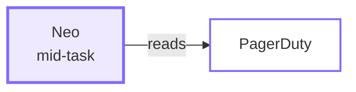
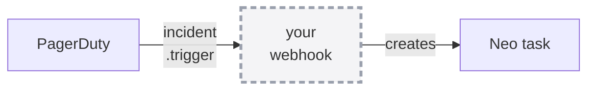

<div class="absolute inset-0 flex flex-col justify-center items-start px-20">
  <h1 class="!text-[5.4rem] !leading-[1.04] !font-semibold !tracking-tight !mb-6 !max-w-[95%]">
    Extending Pulumi Neo
  </h1>
  <p class="!mt-2 !text-[2.1rem] text-[var(--p-fg-muted)] !m-0 !leading-relaxed">
    MCP servers and cloud CLIs — giving Neo the systems your incidents live in
  </p>
  <p class="!mt-6 !text-[1.8rem] text-[var(--p-fg-muted)] !m-0 !leading-relaxed">
    Adam Gordon Bell · Engin Diri · Pulumi
  </p>
</div>

<!--
60 minutes. Two live demos, everything else slides.

Frame the hour in one sentence before moving: "Neo could always write Pulumi —
today is about giving it everything around the Pulumi."
-->

---

<div class="absolute inset-0 flex items-center px-24 gap-20">
  <div class="flex-shrink-0">
    
  </div>
  <div class="flex-1">
    <h1 class="!text-[7rem] !leading-[1.02] !font-semibold !tracking-tight !mb-4 !text-[var(--p-primary)]">Adam Gordon Bell</h1>
    <p class="!text-[2.5rem] !leading-relaxed !m-0 opacity-90">
      Community Engineer at <strong class="!text-[var(--p-primary)]">Pulumi</strong>
    </p>
    <div class="!mt-8 flex items-center gap-8 !text-[1.5rem] opacity-70">
      <span class="flex items-center gap-2"><carbon-logo-x /> @adamgordonbell</span>
      <span class="flex items-center gap-2"><carbon-logo-linkedin /> adamgordonbell</span>
      <span class="flex items-center gap-2"><carbon-logo-github /> adamgordonbell</span>
    </div>
    <p class="!mt-10 !text-[1.75rem] !leading-relaxed opacity-70 !m-0">
      Host of the CoRecursive podcast.<br/>
      Telling the stories behind the code.
    </p>
  </div>
</div>

<!--
Short. Nobody came for the bio.
-->

---

<div class="absolute inset-0 flex items-center px-24 gap-20">
  <div class="flex-shrink-0">
    
  </div>
  <div class="flex-1">
    <h1 class="!text-[7rem] !leading-[1.02] !font-semibold !tracking-tight !mb-4 !text-[var(--p-primary)]">Engin Diri</h1>
    <p class="!text-[2.5rem] !leading-relaxed !m-0 opacity-90">
      Senior Solutions Architect at <strong class="!text-[var(--p-primary)]">Pulumi</strong>
    </p>
    <div class="!mt-8 flex items-center gap-8 !text-[1.5rem] opacity-70">
      <span class="flex items-center gap-2"><carbon-logo-x /> @_ediri</span>
      <span class="flex items-center gap-2"><carbon-logo-linkedin /> engin-diri</span>
      <span class="flex items-center gap-2"><carbon-logo-github /> dirien</span>
    </div>
    <p class="!mt-10 !text-[1.75rem] !leading-relaxed opacity-70 !m-0">
      Building platform tooling and infrastructure-as-code.<br/>
      Helping teams ship cloud infrastructure faster. With and without agents.
    </p>
  </div>
</div>

<!--
Engin built the December workshop this session's incident beat comes from, and
he runs the EMEA session on Sep 30.

Say it here rather than saving it — it sets up "December: what this took" later,
so that slide lands as credit rather than as a detour.
-->

---

# Housekeeping

<div class="zoom-content">

<ul class="!mt-8 !text-[1.6rem] !leading-relaxed space-y-5">
  <li>I'll <strong>present and demo</strong> — nothing to follow along with</li>
  <li>Ask questions <strong>any time</strong>; treat this as a conversation</li>
  <li>Slides and the repo go home with you — QR at the end</li>
</ul>

</div>

<style scoped>
.zoom-content { zoom: 1.7; }
</style>

<!--
"Nothing to follow along with" is deliberate — it stops people from spending the
first ten minutes trying to get an org set up instead of listening.
-->

---

# Where we’re going

<div class="zoom-content">

<ul class="!mt-8 !text-[1.5rem] !leading-relaxed space-y-5">
  <li><strong class="!text-[var(--p-primary)]">what</strong> — Neo, and what day two means</li>
  <li><strong class="!text-[var(--p-primary)]">why</strong> — what it couldn’t see</li>
  <li><strong class="!text-[var(--p-primary)]">ask</strong> — you hand it a ticket, it hands back a PR</li>
  <li><strong class="!text-[var(--p-primary)]">delegate</strong> — a page fires, and the picture is assembled</li>
  <li><strong class="!text-[var(--p-primary)]">scope</strong> — what it can reach, and who decided</li>
  <li><strong class="!text-[var(--p-primary)]">unattended</strong> — it runs without you</li>
</ul>

</div>

<style scoped>
.zoom-content { zoom: 1.5; }
</style>

<!--
These five words are the deck's navigation: they sit in the top-right corner of
every slide, cross off as you pass them, and are clickable if someone asks you to
go back.

Don't read the list. Say the story: teams delegated things they used to keep in
their heads, then stopped initiating them at all.
-->

---
layout: section
routeAlias: stage-what
---

# what

## Neo, and the work it's for

<StageMap size="lg" />

---

# What Neo is

<div class="zoom-content">

<p class="!mt-6 !text-[1.7rem] !leading-relaxed">
Pulumi's own <strong>infrastructure agent</strong>. It reads your organization's
live state in Pulumi Cloud — your programs, your stacks, what's actually running.
</p>

<p class="!mt-7 !text-[1.7rem] !leading-relaxed">
Ask it something, and depending on what you asked it will
<strong>answer</strong>, <strong>investigate</strong>, <strong>review a change</strong>,
or <strong>open a pull request</strong> against your IaC.
</p>

<p class="!mt-7 !text-[1.7rem] !leading-relaxed opacity-85">
Not a console click. A diff, with a preview, that your reviewers still gate.
</p>

</div>

<style scoped>
.zoom-content { zoom: 1.25; }
</style>

<!--
⏱ NINETY SECONDS. This opens `what`. It's a stage-setter, not a Neo talk — the room registered
for integrations. Resist listing features.

Say the shape, not the catalog: it can see your infrastructure, and the way it
hands work back is a pull request. Those two facts are all the rest of the hour
needs.

If you want one concrete line: "which of my resources are on an outdated
provider" is a question it answers by searching real state, not by guessing.

⛔ Don't enumerate PR review, previews, automations, skills. Automations show up
later in `unattended` and earn their place there.

Docs, if pressed: pulumi.com/docs/ai/neo/ — Claude models via Amazon Bedrock.
-->

---

# Day two

<div class="zoom-content">

<p class="!mt-6 !text-[1.7rem] !leading-relaxed">
<strong>Day one</strong> is standing it up. The tutorial, the first <code>pulumi up</code>,
the green check.
</p>

<p class="!mt-7 !text-[1.7rem] !leading-relaxed">
<strong>Day two</strong> is every day after that. The alert at 2am. The provider that
went out of date. The security group somebody added by hand and never told you about.
The upgrade nobody has time for.
</p>

<p class="!mt-7 !text-[1.7rem] !leading-relaxed !text-[var(--p-primary)] !font-semibold">
Day one is a demo. Day two is a job — and it's the whole rest of this hour.
</p>

</div>

<style scoped>
.zoom-content { zoom: 1.22; }
</style>

<!--
⏱ SIXTY SECONDS, and it earns its place: it names the subject so nothing later
has to be justified. Every demo today is day-two work.

The term is borrowed and the room may already have it — "day-2 operations" is
common in platform circles, and Engin's December workshop was literally titled
"Day-2 Autonomous Infrastructure Management". Say it's a known idea rather than
presenting it as yours.

The list is deliberate: each item maps to something they're about to see.
- alert at 2am        -> the PagerDuty demo (delegate)
- provider out of date -> the scheduled automation (unattended)
- security group added by hand -> the unmanaged resource in demo 2 (this is the
  one that pays off hardest, and it's the reason the Context API slide lands)
- upgrade nobody has time for -> the Linear ticket (ask)

Don't announce the mapping. Just make sure the words match what shows up later,
so it feels inevitable rather than coincidental.

⛔ Don't oversell "2am". Adam has not been paged at 2am for this system; keep it
as the generic shape of on-call, not a war story you'd have to back up.
-->

---

# You can go and play with this

<div class="zoom-content">

<p class="!mt-6 !text-[1.7rem] !leading-relaxed">
Neo is <strong>on by default</strong> in Pulumi Cloud. Settings &rarr; Neo Settings.
If you have an org, you already have it.
</p>

<p class="!mt-7 !text-[1.7rem] !leading-relaxed">
Point it at a stack you already have and ask it something you actually want to know.
</p>

<p class="!mt-7 !text-[1.6rem] !leading-relaxed opacity-85">
Genuinely — this part is fun. Everything I show today started as me poking at it.
</p>

</div>

<div class="flex justify-center items-center gap-8 !mt-6">
  
  <p class="!text-[1.5rem] !font-semibold !m-0">app.pulumi.com</p>
</div>

<style scoped>
.zoom-content { zoom: 1.25; }
</style>

<!--
⏱ THIRTY SECONDS. Warmth, not a pitch.

⚠️ Housekeeping just told them there's nothing to follow along with, and that
was deliberate — you don't want the room setting up orgs instead of listening.
So the invitation is for AFTERWARDS. Say "later today", not "right now".

The honest hook is the last line. This is the one moment to be personal about
it: you built the whole session by poking at it, and the interesting findings
were ones you didn't plan.

⛔ Do not say Neo is free. Neo tokens meter at $3/M (pulumi.com/pricing) and the
14-day trial is Business Critical. "On by default if you have an org" is the
claim that's true; leave money out of it.

Mechanics are on the closing QR slide — don't give a URL from here.
-->

---
layout: section
routeAlias: stage-why
---

# why

## what it couldn’t see

<StageMap size="lg" />

---

# Neo already knew what Pulumi knew

<div class="zoom-content">

<p class="!mt-10 !text-[1.7rem] !leading-relaxed">
Your programs, your stacks, your state. It could write a change, preview it, and
deploy it.
</p>

<p class="!mt-8 !text-[1.7rem] !leading-relaxed opacity-85">
What it couldn’t see was everything Pulumi doesn’t record — the alert in PagerDuty,
the ticket in Linear, the metric in Datadog. And the parts of your cloud account
<strong>Pulumi doesn’t manage</strong>.
</p>

<p class="!mt-8 !text-[1.7rem] !leading-relaxed">
So a human read three consoles, and <em>then</em> asked for the change.
</p>

</div>

<style scoped>
.zoom-content { zoom: 1.4; }
</style>

<!--
⚠️ Be precise here — an earlier draft of this slide said "Neo could always write
Pulumi", which undersells it and misnames the gap. Neo could always RUN things
too: pulumi up, previews, live stack state. Someone in the room knows that.

The real limit was the BOUNDARY OF PULUMI'S OWN KNOWLEDGE. State files record what
Pulumi manages. They don't record the incident, the ticket, the metric, or the
security group somebody added in the console.

Concrete hook if you want one: p95 on /checkout goes from 200ms to 1.2s. The
metric is in one tool, the cause is in the cloud account, the fix is one line of
Pulumi. Three places, one person, twenty minutes of tab-switching.
-->

---

# Now that boundary has a name

<p class="!mt-8 !text-[1.6rem] !leading-relaxed">Shipped last week: one queryable graph over state, stack dependencies, and the resources Discovery finds <strong>outside IaC entirely</strong>. Neo uses it out of the box.</p>

<div class="flex justify-center !mt-6">
  
</div>

<div class="demo-foot !mt-5">
  <DemoCta href="https://www.pulumi.com/blog/pulumi-context-api/" label="Read the launch post" />
</div>

<!--
Aug 26 2026 — literally days before this session. Worth saying so; it dates the
talk in a good way.

The line that matters, from the post, close to verbatim: Neo "uses it out of the
box — ask Neo what breaks if a stack changes, and it queries the graph on your
behalf, WITH THE PERMISSIONS OF THE USER WHO INVOKED IT."

That last clause is the same acting-user story the CLI integrations tell later.
Both halves of this talk agree on who the agent is acting as. Plant it here and
call back to it in the scope section.

⛔ Preview, and Enterprise / Business Critical only. Say that out loud — part of
the room cannot run it today, so do not let it carry the argument.

⛔ Do not say "Pulumi couldn't see unmanaged resources before." Discovery has
found them for a while; what is new is querying them in ONE graph alongside
state and dependencies.
-->

---

# 90% of that account is not Pulumi <DemoBadge kind="live" />

<div class="flex justify-center gap-20 !mt-6">
  <div class="text-center">
    <div class="text-[5.5rem] leading-none font-bold" style="color: var(--p-primary)">1305</div>
    <div class="!mt-3 text-[1.5rem] opacity-80">found by cloud scan,<br/>no IaC tool</div>
  </div>
  <div class="text-center">
    <div class="text-[5.5rem] leading-none font-bold opacity-60">144</div>
    <div class="!mt-3 text-[1.5rem] opacity-80">managed by<br/>Pulumi</div>
  </div>
</div>

<p class="!mt-8 !text-[1.5rem] !leading-relaxed text-center">One query. My own org, this morning.</p>

<div class="ctx-cmd !mt-5">

```bash
pulumi api GraphQuery -F orgName=<org> --input coverage-by-tool.json
```

</div>

<div class="demo-foot !mt-6">
  <DemoCta href="https://app.pulumi.com/adamgordonbell-org/insights" label="Open Insights" />
</div>

<style scoped>
.ctx-cmd pre,
.ctx-cmd code { font-size: 1.2rem !important; line-height: 1.75 !important; }
.ctx-cmd pre { padding: 0.9rem 1.2rem !important; }
</style>

<!--
🔴 RUN THIS LIVE if the room is warm — it is one command, read-only, and the
numbers are the whole argument for the rest of the hour. Selector is at
demo/context-api/coverage-by-tool.json. Falls back to this slide if it fails.

Verified Aug 27 2026: 1305 "Other" vs 144 "Pulumi". Re-run before you present —
these numbers move, and quoting a stale count is the kind of thing that gets
noticed.

The selector groups by `managed`, whose value set is ARM, CloudFormation, Other,
Pulumi, Terraform. "Other" = scanned, attributed to no IaC tool. In an org with
Terraform the split looks different — good aside if asked.

THIS IS THE SETUP FOR THE WHOLE TALK. Neo can already reason about the 144. The
1305 is why it needs to reach past Pulumi's own records. Everything after this
slide is about that reach.

⚠️ Do not say the graph cannot see unmanaged resources — it can, and someone
will know. The distinction is INDEX vs LIVE: the graph answers from a search
index that trails reality (the API's own primer says to confirm against the
source of record before acting on an absence). The CLI reads the account now.
That is the honest version, and it is the one that sets up demo 2.
-->

---
layout: two-cols
---

::header::

# Two kinds of integration

::left::

<div class="!mt-6">
<div class="!text-[2.1rem] !font-semibold !text-[var(--p-primary)]">MCP — your SaaS tools</div>

<p class="!mt-5 !text-[1.45rem] !leading-relaxed opacity-85">
PagerDuty · Linear · Datadog · Honeycomb · Atlassian · Supabase
</p>

<p class="!mt-6 !text-[1.45rem] !leading-relaxed opacity-85">
<strong>Pulumi Cloud holds the credentials</strong>, encrypted per organization.
</p>
</div>

::right::

<div class="!mt-6">
<div class="!text-[2.1rem] !font-semibold !text-[var(--p-primary)]">Cloud CLI — your cloud accounts</div>

<p class="!mt-5 !text-[1.45rem] !leading-relaxed opacity-85">
<code>aws</code> · <code>gcloud</code> · <code>az</code> · <code>kubectl</code>
</p>

<p class="!mt-6 !text-[1.45rem] !leading-relaxed opacity-85">
<strong>You hold the credentials</strong>, in Pulumi ESC. Pulumi Cloud never stores them.
</p>
</div>

<!--
⚠️ Do NOT frame this as "MCP reads, CLI runs". It isn't true — Neo writes over MCP
too: it resolves the incident back to PagerDuty and comments on the Linear ticket.
Someone will call that out.

The distinction that actually holds is the two on the slide: WHAT it reaches, and
WHO HOLDS THE KEY. That second half is also the setup for the scope section, so
you get it for free later rather than repeating yourself.

The cloud CLI is the one that closes the gap from the previous slide: it reaches
resources Pulumi never managed.
-->

---

# It’s a toggle

<p class="!mt-4 !text-[1.6rem] !leading-relaxed">Settings → Integrations. Six of them, each with an <strong>Authorize</strong> button.</p>

<div class="flex justify-center !mt-6">
  
</div>

<!--
Let the screenshot do the work. Two things to say over it:

- An org admin turns one on. That is the whole setup step.
- What used to be a webhook service, a deployment, and a pile of glue code is now
  a row in a list.

Full width on purpose — in the image-right column two of the six cards were cut
off, on the slide that claims there are six.

Don't spend the December comparison here; you come back to it properly in
"December: what this took". This is just planting it.
-->

---

# Demo <DemoBadge kind="recorded" />

<p class="demo-sub">Turning one on — Honeycomb, 24 seconds</p>

<div class="demo-stage">
  <video src="/video/honey-comb.mp4" autoplay loop muted />
</div>

<div class="demo-foot">
  <DemoCta href="https://app.pulumi.com/adamgordonbell-org/settings/integrations" label="Open the integrations page" />
</div>

<!--
🎬 honey-comb.mp4 — 24 seconds, silent, loops.

The button goes to the real settings page. Click it if the room looks
skeptical that it's this small; otherwise let the video carry it.

TALK OVER IT. It loops, so there's no rush and no dead air.

"That's Honeycomb. Same flow for PagerDuty, Linear, Datadog. Authorize, and Neo
can read from it inside a task."
-->

---
layout: statement
---

# Every demo today ends the same way

<p class="!mt-8 !text-[3.4rem] !font-semibold !text-[var(--p-primary)]">a reviewable pull request</p>

<p class="!mt-6 !text-[2rem] text-[var(--p-fg-muted)]">Neo proposes. A human merges.</p>

<div class="demo-foot !mt-10">
  <DemoCta href="https://github.com/adamgordonbell/neo-examples/pull/7" label="A real one: neo-examples #7" />
</div>

<!--
LOAD-BEARING. Say it clearly and let it sit.

The button opens a genuine merged PR — Neo removing three unused resources it
found: an EBS volume for a database that doesn't exist, an ALB with no
listeners, a security group for an absent API Gateway. Scroll the body if you
open it — it says what each one was and why it was safe to delete. That body
is the argument.

Two reasons it's here, before any demo:
1. If every demo fails, the argument still landed.
2. It sets up the credential payoff in the Scope section — Neo never needed
   write access, because the output was always a PR.

Called back explicitly on the `pulumi env run` slide.
-->

---
layout: section
routeAlias: stage-ask
---

# ask

## you hand it a ticket, it hands back a pull request

<StageMap size="lg" />

---

# The work that never reaches the top

<div class="queue">

<div class="queue-col">
  <div class="queue-label">wins the morning</div>
  <div class="tkt hot">SEV-2 · checkout 500s</div>
  <div class="tkt hot">Customer escalation</div>
  <div class="tkt hot">Release cut</div>
</div>

<div class="queue-col">
  <div class="queue-label">never urgent, never done</div>
  <div class="tkt cold">Bump the provider version</div>
  <div class="tkt cold">Centralize that secret</div>
  <div class="tkt cold">Close a policy violation</div>
  <div class="tkt cold">Narrow an over-broad IAM role</div>
  <div class="tkt cold">Tag the untagged resources</div>
</div>

</div>

<style scoped>
.queue { display: flex; gap: 4.5rem; justify-content: center; margin-top: 2.4rem; }
.queue-col { display: flex; flex-direction: column; gap: 0.85rem; width: 24rem; }
.queue-label {
  font-size: 1.15rem; font-weight: 600; letter-spacing: 0.04em;
  text-transform: uppercase; color: var(--p-fg-muted); margin-bottom: 0.4rem;
}
.tkt {
  font-size: 1.32rem; padding: 0.8rem 1.15rem; border-radius: 0.55rem;
  border: 2px solid var(--p-primary);
}
.tkt.hot { font-weight: 600; }
/* The right-hand column fades down the stack — the visual argument is that
   these sink, not that they are a different category. Opacity + dashes only;
   no colour coding. */
.tkt.cold { border-style: dashed; border-color: var(--p-fg-muted); }
.tkt.cold:nth-child(2) { opacity: 0.85; }
.tkt.cold:nth-child(3) { opacity: 0.68; }
.tkt.cold:nth-child(4) { opacity: 0.51; }
.tkt.cold:nth-child(5) { opacity: 0.34; }
.tkt.cold:nth-child(6) { opacity: 0.22; }
</style>

<!--
Let the two columns do the talking. The right column fades as it goes down —
that IS the point, so don't explain it.

What to say over it:

- These pile up not because they're unimportant, but because they're never
  urgent. Each one matters. None of them ever wins the morning.
- Bump a provider version. Centralize a secret. Close out a small policy
  violation. Narrow a role. Everyone in the room has this list.

PIVOT — this is the line that earns the next slide:
  Explaining each one to an agent is its own overhead. That is the part
  integrations remove. The fix isn't a better prompt — it's letting Neo read
  the ticket itself: title, description, acceptance criteria, the way an
  engineer would.
-->

---
layout: statement
---

# Demo <DemoBadge kind="live" />

<p class="!mt-8 !text-[2.6rem] !text-[var(--p-primary)] !font-semibold">A Linear ticket, start to pull request</p>

<p class="!mt-8 !text-[1.7rem] text-[var(--p-fg-muted)]">pulumi neo</p>

<div class="demo-foot !mt-10">
  <DemoCta href="https://linear.app/" label="Open the ticket" />
</div>

<!--
🔴 LIVE DEMO 1 — target 5 minutes, hard stop 7.

  pulumi neo
  > Implement <TICKET-ID> in this stack.

Narrate while it works — don't watch it in silence:
- it's reading the ticket, not me pasting the ticket
- plan mode first, so I see the resources before anything happens
- the PR gets linked back on the ticket

FALLBACK: play /video/neo-linear.mp4 (76s) — it's the same thing, in the same
CLI. Switch without apologizing for it.

DO NOT debug live past one retry. Go to the video and keep the clock.
-->

---

# What just happened

<div class="zoom-content">

<ul class="!mt-8 !text-[1.55rem] !leading-relaxed space-y-5">
  <li>One integration, authorized once by an admin</li>
  <li>Neo read the <strong>ticket itself</strong> — title, description, acceptance criteria</li>
  <li>It planned against the real stack, not a guess about the stack</li>
  <li>Output was a <strong>pull request</strong>, and a comment back on the ticket</li>
</ul>

<p class="!mt-10 !text-[1.6rem] !leading-relaxed opacity-85">
The ticket and the PR end up linked. The backlog gets shorter.
</p>

</div>

<style scoped>
.zoom-content { zoom: 1.4; }
</style>

<!--
Keep this tight — 60 seconds. It's a landing, not a recap.
-->

---
layout: section
routeAlias: stage-delegate
---

# delegate

## a page fires, and the picture is already assembled

<StageMap size="lg" />

---

# On-call triage is the first twenty minutes

<div class="triage">

<div class="triage-bar">
  <div class="seg seg-assemble">
    <div class="seg-title">assembling</div>
    <div class="seg-body">what deployed recently · what changed in the stack · what the metrics did · when it started</div>
    <div class="seg-tools">PagerDuty → Pulumi → Datadog → the console</div>
  </div>
  <div class="seg seg-fix">
    <div class="seg-title">fixing</div>
  </div>
</div>

<div class="triage-axis">
  <span>the page fires</span>
  <span>~20 minutes</span>
</div>

<p class="triage-note">That assembly is <strong>reading</strong>. Which is exactly what an integration is for.</p>

</div>

<style scoped>
.triage { margin-top: 2.6rem; }
.triage-bar { display: flex; gap: 0.6rem; align-items: stretch; }
.seg { border-radius: 0.6rem; padding: 1.3rem 1.5rem; }
.seg-assemble {
  flex: 4;
  border: 2px dashed var(--p-fg-muted);
  background: color-mix(in srgb, var(--p-fg-muted) 8%, transparent);
}
.seg-fix {
  flex: 1;
  border: 2px solid var(--p-primary);
  display: flex; align-items: center; justify-content: center;
}
.seg-title {
  font-size: 1.5rem; font-weight: 700; letter-spacing: 0.03em;
  text-transform: lowercase; color: var(--p-primary);
}
.seg-body { margin-top: 0.7rem; font-size: 1.24rem; line-height: 1.5; opacity: 0.85; }
.seg-tools { margin-top: 0.85rem; font-size: 1.16rem; font-family: var(--p-font-mono, monospace); opacity: 0.7; }
.triage-axis {
  display: flex; justify-content: space-between;
  margin-top: 0.7rem; font-size: 1.1rem; color: var(--p-fg-muted);
}
.triage-note { margin-top: 2.4rem; font-size: 1.62rem; line-height: 1.5; }
</style>

<!--
Room-recognition slide. Anyone who has carried a pager knows these twenty
minutes — point at the wide box, not the narrow one.

What to say over it:

- You get paged because something is red. You don't know why yet.
- So the first twenty minutes aren't fixing. They're assembling: what deployed
  recently, what changed in the stack, what the metrics did, when it started.
- Four tools, one person, and you haven't touched the problem yet.

Then the line on the slide.

Don't claim Neo fixes incidents. Claim it collapses the assembly step — that's
both true and the more credible pitch.
-->

---
layout: two-cols
---

::header::

# What's a toggle now, and what isn't

<p class="credit">The wiring below is what <strong>Engin Diri</strong> built and we co-presented in December — <em>Day-2 Autonomous Infrastructure Management</em>.</p>

::left::

<p class="!mt-2 !text-[1.75rem] !font-semibold !text-[var(--p-primary)]">The reading half</p>



<p class="!mt-4 !text-[1.4rem] opacity-85">Neo pulling incident detail while it works.</p>

<p class="!mt-4 !text-[1.5rem] !font-semibold">That's now a toggle.</p>

::right::

<p class="!mt-2 !text-[1.75rem] !font-semibold opacity-70">The triggering half</p>



<p class="!mt-4 !text-[1.4rem] opacity-85">A page automatically starting a task.</p>

<p class="!mt-4 !text-[1.5rem] !font-semibold opacity-85">Still the webhook. Still yours to wire.</p>

<style scoped>
.credit { margin-top: -0.4rem; font-size: 1.16rem; line-height: 1.5; color: var(--p-fg-muted); }
</style>

<!--
⛔ DO NOT SAY the integration replaced what Engin built. It didn't.

Credit him out loud, not just on the slide — it was his workshop, I co-presented.
  Recording: youtube.com/watch?v=nx6oJvX2JNE
  Repo: github.com/dirien/pulumi-ai-workshop-base

Inbound vs outbound:
- his webhook = INBOUND. PagerDuty fires -> Neo API creates a task.
- MCP integration = OUTBOUND. Neo reads PagerDuty during a task already running.

The line: "the reading half is now a toggle; the triggering half is still yours
to wire."

Being precise here costs nothing and buys credibility for the whole talk.
-->

---
layout: statement
---

# Demo <DemoBadge kind="live" />

<p class="!mt-8 !text-[2.6rem] !text-[var(--p-primary)] !font-semibold">A real page, to a merged fix</p>

<p class="!mt-8 !text-[1.7rem] text-[var(--p-fg-muted)]">PagerDuty + aws, from the terminal</p>

<div class="demo-foot !mt-10">
  <DemoCta href="https://app.pagerduty.com/incidents" label="Open the incident" />
</div>

<!--
🔴 LIVE DEMO 2 — target 15 minutes. THE session. Never cut.

  1. Trigger the incident — real page, real timestamp, in front of them
  2. pulumi neo
     > There's an active PagerDuty incident. What's going on?
  3. Neo reads the incident            (PagerDuty, MCP)
  4. Neo inspects what's running       (aws, ESC-backed)
  5. Neo edits the program, previews
  6. PR opens. Resolve back to PagerDuty.

⭐ THE BEAT THAT EARNS THE SCOPE SECTION: among the findings is a security
group attached to payments-db, open to 0.0.0.0/0 on 5432, that NO PULUMI
PROGRAM DESCRIBES. Reading the code cannot find it. Only `aws` can.

If Neo stays inside the program, nudge once — without naming it:
  > Is there anything running in the account that this program doesn't describe?

Say the quiet part when it surfaces: "that one isn't in my code. It found it
by looking at the account."

Be honest about the severity — the instance is publiclyAccessible: false, so
it's an audit finding, not a live breach. Saying so is what makes the rest
credible. If Neo notes the mitigation itself, point at that.

Narrate the seams — that's where the content is:
- "it's reading the incident, I haven't pasted anything"
- "now it's looking at the live account, not the program"
- "and the fix is a diff, not an API call"

THE FINDING IS CONFIGURATION-SHAPED ON PURPOSE. If asked why not a trend:
a fresh account has no history. Config bugs are visible in one look and are
just as real.

If it dies: say what should have happened, and move to Scope. The argument
from slide 9 already landed.
-->

---

# What just happened

<div class="zoom-content">

<ul class="!mt-8 !text-[1.5rem] !leading-relaxed space-y-5">
  <li>A <strong>real incident</strong>, with a real timestamp — not a fixture</li>
  <li>Neo read it through PagerDuty, and read the live account through <code>aws</code></li>
  <li>It connected the alert to a <strong>specific line in the program</strong></li>
  <li>And it found something <strong>the program never mentioned</strong> — only the account did</li>
  <li>Both fixes arrived as a diff, with the evidence sitting next to them</li>
</ul>

</div>

<style scoped>
.zoom-content { zoom: 1.4; }
</style>

<!--
Name the finding out loud and say why it's config-shaped rather than a trend.
Being upfront about the constraint reads as confidence, not as a limitation.
-->

---
layout: section
routeAlias: stage-scope
---

# scope

## what it can reach, and who decided

<StageMap size="lg" />

---
layout: statement
---

# So what can this thing actually reach?

<p class="!mt-8 !text-[1.9rem] text-[var(--p-fg-muted)]">The question you've been holding since slide one</p>

<!--
Say it before they have to ask it. Naming the discomfort is what makes the next
three slides land.

If someone already asked in chat, credit them by name here.
-->

---

# Four of them

<p class="!mt-4 !text-[1.6rem] !leading-relaxed">AWS, Google Cloud, Azure, Kubernetes. Same settings page, a separate <strong>CLI tools</strong> section.</p>

<div class="flex justify-center !mt-6">
  
</div>

<!--
The mirror of "It's a toggle" from the why section — that slide showed the MCP
catalog, this one shows the CLI half. The talk is titled after both, so both
get a screenshot.

Worth saying: each one is NAMED. production-aws, staging-aws. The name is how
a task says which account it means, and you can connect several instances of
the same CLI.

Each is backed by an ESC environment your org owns — which is the next slide.
-->

---
layout: two-cols
---

::header::

# It reads with the CLI. It writes with Pulumi.

::left::

<div class="!mt-5 !text-[1.4rem] !leading-relaxed space-y-4">

<p class="!text-[1.8rem] !font-semibold !text-[var(--p-primary)]">Reading — <code>aws</code>, <code>gcloud</code>, <code>az</code>, <code>kubectl</code></p>

<p class="opacity-85">Neo shells out to the CLI to <strong>look</strong>: list the buckets, describe the instance, check the firewall rule.</p>

<p class="opacity-85">That's how it sees the live account — including the parts <strong>Pulumi never managed</strong>. You just watched that: the security group that was in the account and in no program.</p>

</div>

::right::

<div class="!mt-5 !text-[1.4rem] !leading-relaxed space-y-4">

<p class="!text-[1.8rem] !font-semibold !text-[var(--p-primary)]">Writing — one path only</p>

<p class="opacity-85">A change to the program. A preview. A pull request. You merge it, and <strong>Pulumi</strong> makes the change.</p>

<p class="opacity-85">Neo never calls <code>aws</code> to <em>alter</em> anything. If it did, you'd have infrastructure that no code describes.</p>

</div>

<!--
This slide exists because it's the question a good audience asks: "wait, is
Neo running the AWS CLI against my account?"

Yes — to READ. Never to change. Say both halves in one breath.

WHY IT MATTERS, and it's not a detail: if an agent mutates your cloud through
the CLI, you've just created drift that no program describes. The whole value
of doing this inside Pulumi is that the change arrives as code. Reading is a
lookup; writing is a diff.

⛔ SCOPE THE CLAIM to the cloud account. Over MCP, Neo does write — it resolves
the PagerDuty incident and comments on the Linear ticket. That's fine and it's
not the same thing. If someone conflates them, that's the distinction.

Sets up the next slide, which is where this stops being a philosophy and turns
into an IAM role.
-->

---

```bash
pulumi env run adamgordonbell-org/neo-workshop/aws-readonly -- aws rds describe-db-instances
```

<div class="zoom-content">

<p class="!mt-12 !text-[1.65rem] !leading-relaxed">
That's the entire mechanism. ESC opens the environment, materializes short-lived
credentials, runs the command, tears it back down.
</p>

<p class="!mt-8 !text-[1.65rem] !leading-relaxed !text-[var(--p-primary)] !font-semibold">
Read the role name again. Everything you watched today ran against a read-only role.
</p>

<p class="!mt-8 !text-[1.65rem] !leading-relaxed opacity-85">
It runs as <strong>you</strong>, too — if you couldn't open that environment, neither can Neo.
Connecting an integration grants nobody access they didn't already have.
</p>

</div>

<style scoped>
.zoom-content { zoom: 1.3; }
</style>

<!--
THE PAYOFF, and it follows straight from the previous slide: if the only write
path is a pull request, the role never needs write access. Read-only isn't a
precaution here — it's the natural shape.

Pause after "read-only role." Let them do the arithmetic themselves.

The second point is the one that settles a room with a security lead in it:
Neo is not a new identity with its own permissions. `pulumi env run` executes
as the acting user, so an integration only works for people who could already
open that ESC environment.

If someone pushes: yes, you can scope it wider, and named instances let you run
production-aws and staging-aws side by side. But the demo they just watched ran
read-only.
-->

---

# Least privilege, from the thing you suspect has too much

<div class="setup">

<div class="setup-row">
  <div class="setup-k">You have</div>
  <div class="setup-v">Forty roles in production. Half of them start with <code>s3:*</code>, because nobody had time to scope them.</div>
</div>

<div class="setup-row">
  <div class="setup-k">You ask</div>
  <div class="setup-v"><em>"Audit these policies against what the stack code actually calls, and narrow them."</em></div>
</div>

<div class="setup-row">
  <div class="setup-k">You get</div>
  <div class="setup-v">A PR per role — with the API calls it found listed in the body as the justification.</div>
</div>

</div>

<style scoped>
.setup { margin-top: 2.6rem; display: flex; flex-direction: column; gap: 1.5rem; }
.setup-row { display: flex; gap: 1.8rem; align-items: baseline; }
.setup-k {
  flex: 0 0 9rem; text-align: right;
  font-size: 1.3rem; font-weight: 700; letter-spacing: 0.04em;
  text-transform: uppercase; color: var(--p-primary);
}
.setup-v { flex: 1; font-size: 1.5rem; line-height: 1.55; }
</style>

<!--
Setup slide — say these three lines and move on. The video is next and it runs
60 seconds, so don't spend the story here.

The pattern worth naming: the evidence sits next to the diff.
-->

---

# Demo <DemoBadge kind="recorded" />

<p class="demo-sub">Narrowing IAM policies to what the code actually calls — 60 seconds</p>

<div class="demo-stage demo-stage-xl">
  <video src="/video/iam-narrow.mp4" autoplay loop muted />
</div>

<div class="demo-foot">
  <DemoCta href="https://github.com/adamgordonbell/iam-narrow-demo/pull/1" label="Open the PR it produced" />
</div>

<style scoped>
:deep(.pulumi-accent-bar), :deep(.pulumi-footer) { display: none }
</style>

<!--
🎬 iam-narrow.mp4 — 60 seconds, the longest clip in the deck. Chrome is hidden
so it runs as big as the slide allows; narrate straight through it.

Neo cross-references each role's policy against what the stack code actually
calls, then opens a PR per role.

The button opens the real PR. Its body has the before/after table —
s3:* becomes s3:ListBucket + s3:GetObject, scoped to the two audit-logs
buckets. Open it if you want to show the evidence up close.

⚠️ That PR is CLOSED, not merged. Don't call it merged. The diff and the
evidence-in-the-body point both still read fine.
-->

---
layout: two-cols
---

::header::

# Off, for this one task

::left::

<div class="!mt-4 !text-[1.42rem] !leading-relaxed space-y-5">

<p>An admin enables an integration for the whole org. Any <strong>single task</strong> can switch it back off, right in the composer — no config change, no ticket.</p>

<p class="opacity-85">Investigate staging without granting the task production.</p>

<p class="opacity-85">And the instances are <strong>named</strong> — <code>production-aws</code>, <code>staging-aws</code> — each carrying a note Neo reads when it decides which to reach for: <em>"compliance account, avoid mutations."</em></p>

</div>

::right::

<div class="!mt-2">
  
</div>

<!--
The "I want this, but not everywhere" answer — the objection that stops
adoption inside larger orgs. Screenshot from the integrations launch post.

Point at the toggles. The claim is small and concrete: org-level default,
per-task override, and the override is two clicks rather than a permissions
conversation.
-->

---
layout: section
routeAlias: stage-unattended
---

# unattended

## the part where you’re not in the loop anymore

<StageMap size="lg" />

---
layout: quote
---

> Platform engineers used to keep these things in their heads. Then they delegated them to Neo. Then those tasks started running on a schedule, without anyone initiating them.

<!--
This is the thesis of the whole hour, and it's worth reading slowly.

Everything so far has been you asking. The last move is not asking.
-->

---

# Demo <DemoBadge kind="recorded" />

<p class="demo-sub">Set it once — the scheduling UI, 18 seconds</p>

<div class="demo-stage demo-stage-xl">
  <video src="/video/neo-schedule-setup.mp4" autoplay loop muted />
</div>

<div class="demo-foot">
  <DemoCta href="https://app.pulumi.com/adamgordonbell-org/neo/automations" label="Open Automations" />
</div>

<!--
🎬 neo-schedule-setup.mp4 — 18 seconds. SHORT. Narrate deliberately or it
reads as motion rather than content.

Read the instruction out loud as it's typed:
  > Every morning, read CIS Benchmark failures from Security Hub. For every
  > failure on an IaC-managed resource, open a PR with the fix.

That is the whole setup. No schedule config, no runner, no glue.

Say it plainly: this is the one thing I cannot demo live. A task that runs at
6 AM does not run at 12:45 PM. The next slide is what showed up.
-->

---

# The next morning

<p class="demo-sub"><DemoBadge kind="recorded" /> &nbsp;Nobody asked for this one — 17 seconds</p>

<div class="demo-stage demo-stage-xl">
  <video src="/video/neo-cis-pr.mp4" autoplay loop muted />
</div>

<div class="demo-foot">
  <DemoCta href="https://github.com/adamgordonbell/neo-examples/pull/9" label="See what it changed" />
</div>

<!--
🎬 neo-cis-pr.mp4 — 17 seconds.

This is the beat the whole section is for: a pull request that exists because
of a schedule, not because someone opened a session.

Point at the PR body — the CIS rule number, the resource id, the diff, and a
clean preview against live infra.

The button opens the real thing: neo-examples #9, restricting bastion SSH from
0.0.0.0/0 to the VPC CIDR. Merged. If anyone doubts the PR bodies are this
specific, click it.
-->

---
layout: image-right
image: /img/neo-drift-pr.png
---

# The runbook decides

<div class="!mt-8 !text-[1.45rem] !leading-relaxed space-y-5">

<p>Not every drift should be reverted.</p>

<p class="opacity-85">The security team's IAM rotation gets <strong>encoded</strong>.
A console-added security group rule gets <strong>reverted</strong>.
Autoscaler-managed concurrency gets <strong>ignored</strong>.</p>

<p class="opacity-85">You write that down once. Neo reads it every morning and cites the
section it followed.</p>

</div>

<!--
This is the slide that separates "scheduled automation" from "an agent running
unsupervised." The judgment stays in a file your team wrote.

The PR body names the resource, the change, when it happened, and the runbook
section. That citation is the trust mechanism.
-->

---

# What it left behind

<p class="!mt-3 !text-[1.45rem] text-[var(--p-fg-muted)]">Real pull requests, from real sessions. Click any of them.</p>

<div class="trail">

<a class="trail-row" href="https://github.com/adamgordonbell/neo-examples/pull/9" target="_blank" rel="noopener">
  <span class="trail-num">#9</span>
  <span class="trail-title">Restrict bastion SSH access to VPC only</span>
  <span class="trail-note">policy violation · merged</span>
</a>

<a class="trail-row" href="https://github.com/adamgordonbell/neo-examples/pull/7" target="_blank" rel="noopener">
  <span class="trail-num">#7</span>
  <span class="trail-title">Remove unused infrastructure resources</span>
  <span class="trail-note">cost · merged</span>
</a>

<a class="trail-row" href="https://github.com/adamgordonbell/neo-examples/pull/5" target="_blank" rel="noopener">
  <span class="trail-num">#5</span>
  <span class="trail-title">Add burst node group with 2-4 t3.small nodes</span>
  <span class="trail-note">capacity · merged</span>
</a>

<a class="trail-row" href="https://github.com/adamgordonbell/iam-narrow-demo/pull/1" target="_blank" rel="noopener">
  <span class="trail-num">#1</span>
  <span class="trail-title">Narrow IAM policies to least privilege</span>
  <span class="trail-note">access · closed</span>
</a>

</div>

<style scoped>
.trail { margin-top: 1.9rem; display: flex; flex-direction: column; gap: 0.85rem; }
.trail-row {
  display: flex; align-items: baseline; gap: 1.3rem;
  padding: 0.95rem 1.4rem;
  border: 2px solid var(--p-primary); border-radius: 0.6rem;
  text-decoration: none; color: inherit;
  transition: background 0.15s ease;
}
.trail-row:hover { background: color-mix(in srgb, var(--p-primary) 12%, transparent); }
.trail-num {
  flex: 0 0 3.2rem;
  font-family: var(--p-font-mono, monospace);
  font-size: 1.45rem; font-weight: 700; color: var(--p-primary);
}
.trail-title { flex: 1; font-size: 1.42rem; }
.trail-note {
  font-size: 1.08rem; letter-spacing: 0.04em; text-transform: uppercase;
  color: var(--p-fg-muted);
}
</style>

<!--
Closing move of the section: the output is a paper trail you can read.

Every row is live — open one if the room wants to see a body up close. #9 is
the best one to open: policy rule name, security group id, preview results.

⚠️ #1 is CLOSED, not merged. Say "closed" if you open it.

UPGRADE (needs work before Sep 8): what would be better here is browsing the
Neo sessions themselves in Pulumi Cloud and showing the PR each one produced.
The PRs survived; the sessions behind them didn't leave links. Recreating them
in the demo org is on the Aug 27 list. If that doesn't happen, this slide
stands on its own.
-->

---
layout: two-cols
---

::header::

# Where this goes next

::left::

<div class="!mt-6 !text-[1.4rem] !leading-relaxed space-y-6">

<p><strong class="!text-[var(--p-primary)]">Automations</strong><br/>
<span class="opacity-85">Cloud CLI access inside scheduled tasks, not just ones you start.</span></p>

<p><strong class="!text-[var(--p-primary)]">Your editor</strong><br/>
<span class="opacity-85">Neo in Zed, JetBrains, VS Code, Cursor.</span></p>

</div>

::right::

<div class="!mt-6 !text-[1.4rem] !leading-relaxed space-y-6">

<p><strong class="!text-[var(--p-primary)]">Handoff</strong><br/>
<span class="opacity-85">Claude Code and other agents can start a <code>pulumi neo</code> task
and hand infrastructure work over.</span></p>

</div>

<!--
Keep this to 90 seconds. It's a horizon slide, not a roadmap commitment.

⛔ Do NOT name Custom Agents. Not announced, and what we know of its status is
internal pre-release — so even a hint is a leak, not just a risky promise.

✅ You MAY point at the Sep 30 EMEA session and say it goes further — this is
part one, Engin's repeat is part two. Safe as long as you name no feature.

FIRST THING CUT if running long.
-->

---
layout: end
---

# Thanks

<div class="flex justify-center gap-10 !mt-8">

  <div class="text-center">
    
    <p class="!mt-3 !text-[1.15rem] opacity-80 !m-0">Slides &amp; repo</p>
  </div>

  <div class="text-center">
    
    <p class="!mt-3 !text-[1.15rem] opacity-80 !m-0">Ten More Things</p>
  </div>

  <div class="text-center">
    
    <p class="!mt-3 !text-[1.15rem] opacity-80 !m-0">Integrations docs</p>
  </div>

  <div class="text-center">
    
    <p class="!mt-3 !text-[1.15rem] opacity-80 !m-0">EMEA — Sep 30</p>
  </div>

</div>

<p class="!mt-10 !text-[1.9rem] !font-semibold text-center">Questions?</p>

<!--
⚠️ THESE QR CODES ARE PLACEHOLDERS — grey, hatched, and labelled so they cannot
ship by accident. Three of the four already point at real URLs (blog, docs,
event page); the repo one points at github.com/PLACEHOLDER/... and must be
regenerated once the repo has a home.

Regenerate: scripts/make-qr.py (segno + pillow). Drop the hatch and the bar,
switch dark= to the brand violet, and fix the repo URL.

Leave this slide up through Q&A.
-->
