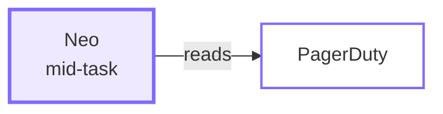
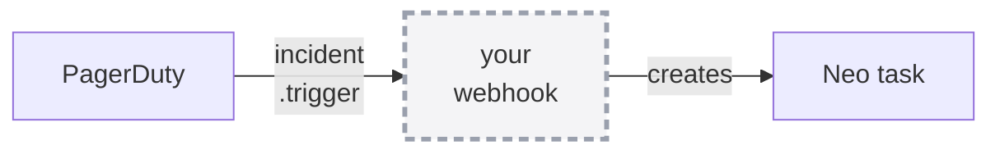

<div class="absolute inset-0 flex flex-col justify-center items-start px-20">
  <h1 class="!text-[5.4rem] !leading-[1.04] !font-semibold !tracking-tight !mb-6 !max-w-[95%]">
    Extending Pulumi Neo
  </h1>
  <p class="!mt-2 !text-[2.1rem] text-[var(--p-fg-muted)] !m-0 !leading-relaxed">
    MCP servers and cloud CLIs — giving Neo the systems your incidents live in
  </p>
  <p class="!mt-4 !text-[1.6rem] text-[var(--p-fg-muted)] !m-0 !leading-relaxed">
    Part 1 of 2 · part 2 with Engin Diri, Sep 30
  </p>
  <p class="!mt-6 !text-[1.8rem] text-[var(--p-fg-muted)] !m-0 !leading-relaxed">
    Adam Gordon Bell · Engin Diri · Pulumi
  </p>
</div>

<!--
- Neo could always write Pulumi. Today is about giving it everything around the Pulumi.
- Two live demos this hour; everything else is slides.
-->

---

<div class="absolute inset-0 flex items-center px-24 gap-20">
  <div class="flex-shrink-0">
    
  </div>
  <div class="flex-1">
    <h1 class="!text-[7rem] !leading-[1.02] !font-semibold !tracking-tight !mb-4 !text-[var(--p-primary)]">Adam Gordon Bell</h1>
    <p class="!text-[2.5rem] !leading-relaxed !m-0 opacity-90">
      Community Engineer at <strong class="!text-[var(--p-primary)]">Pulumi</strong>
    </p>
    <div class="!mt-8 flex items-center gap-8 !text-[1.5rem] opacity-70">
      <span class="flex items-center gap-2"><carbon-logo-x /> @adamgordonbell</span>
      <span class="flex items-center gap-2"><carbon-logo-linkedin /> adamgordonbell</span>
      <span class="flex items-center gap-2"><carbon-logo-github /> adamgordonbell</span>
    </div>
    <p class="!mt-10 !text-[1.75rem] !leading-relaxed opacity-70 !m-0">
      Host of the CoRecursive podcast.<br/>
      Telling the stories behind the code.
    </p>
  </div>
</div>

<!--
- Community Engineer at Pulumi, and host of the CoRecursive podcast. One sentence is enough.
-->

---

<div class="absolute inset-0 flex items-center px-24 gap-20">
  <div class="flex-shrink-0">
    
  </div>
  <div class="flex-1">
    <h1 class="!text-[7rem] !leading-[1.02] !font-semibold !tracking-tight !mb-4 !text-[var(--p-primary)]">Engin Diri</h1>
    <p class="!text-[2.5rem] !leading-relaxed !m-0 opacity-90">
      Senior Solutions Architect at <strong class="!text-[var(--p-primary)]">Pulumi</strong>
    </p>
    <div class="!mt-8 flex items-center gap-8 !text-[1.5rem] opacity-70">
      <span class="flex items-center gap-2"><carbon-logo-x /> @_ediri</span>
      <span class="flex items-center gap-2"><carbon-logo-linkedin /> engin-diri</span>
      <span class="flex items-center gap-2"><carbon-logo-github /> dirien</span>
    </div>
    <p class="!mt-10 !text-[1.75rem] !leading-relaxed opacity-70 !m-0">
      Building platform tooling and infrastructure-as-code.<br/>
      Helping teams ship cloud infrastructure faster. With and without agents.
    </p>
  </div>
</div>

<!--
- Engin built the December "Day-2 Autonomous Infrastructure Management" workshop, and the incident demo today comes from it.
- He runs the EMEA session on Sep 30, which is part two of this one.
-->

---

# Housekeeping

<div class="zoom-content">

<ul class="!mt-8 !text-[1.6rem] !leading-relaxed space-y-5">
  <li>I'll <strong>present and demo</strong> — nothing to follow along with</li>
  <li>Ask questions <strong>any time</strong>; treat this as a conversation</li>
  <li>Slides and the repo go home with you — QR at the end</li>
</ul>

</div>

<style scoped>
.zoom-content { zoom: 1.7; }
</style>

<!--
- There is nothing to follow along with. Watch now; the slides and the repo go home with you, so you can run everything later.
- Ask questions any time, and treat this as a conversation.
-->

---

# What Neo is

<div class="zoom-content">

<p class="!mt-6 !text-[1.7rem] !leading-relaxed">
Pulumi's own <strong>infrastructure agent</strong>. It reads your organization's
live state in Pulumi Cloud — your programs, your stacks, what's actually running.
</p>

<p class="!mt-7 !text-[1.7rem] !leading-relaxed">
Ask it something, and depending on what you asked it will
<strong>answer</strong>, <strong>investigate</strong>, <strong>review a change</strong>,
or <strong>open a pull request</strong> against your IaC.
</p>

<p class="!mt-7 !text-[1.7rem] !leading-relaxed opacity-85">
The result is not a console click but a diff, with a preview, that your reviewers still gate.
</p>

</div>

<style scoped>
.zoom-content { zoom: 1.25; }
</style>

<!--
- Neo is Pulumi's infrastructure agent. It reads your organization's live state in Pulumi Cloud: your programs, your stacks, and what is actually running.
- It can see your infrastructure, and it hands work back as a pull request. Those two facts are all the rest of the hour needs.
- One concrete example: "which of my resources are on an outdated provider" is a question it answers by searching real state rather than guessing.
- The docs are at pulumi.com/docs/ai/neo/, and it runs Claude models through Amazon Bedrock.
-->

---

# Day two

<div class="zoom-content">

<p class="!mt-6 !text-[1.7rem] !leading-relaxed">
<strong>Day one</strong> is standing it up: the tutorial, the first <code>pulumi up</code>,
the green check.
</p>

<p class="!mt-7 !text-[1.7rem] !leading-relaxed">
<strong>Day two</strong> is every day after that: the alert at 2am, the provider that
went out of date, the security group somebody added by hand and never mentioned,
the upgrade nobody has time for.
</p>

<p class="!mt-7 !text-[1.7rem] !leading-relaxed !text-[var(--p-primary)] !font-semibold">
Day one makes a good demo. Day two is a job, and it is what the rest of this hour is about.
</p>

</div>

<style scoped>
.zoom-content { zoom: 1.22; }
</style>

<!--
- Day one is standing it up. Day two is every day after that. "Day-2 operations" is a common term in platform circles, and Engin's December workshop was titled after it.
- The alert at 2am, the provider that went out of date, the security group somebody added by hand, the upgrade nobody has time for. Every demo today is one of these.
- Day one makes a good demo. Day two is a job, and it is what the rest of the hour is about.
-->

---

# You can go and play with this

<div class="zoom-content">

<p class="!mt-6 !text-[1.7rem] !leading-relaxed">
Neo is <strong>on by default</strong> in Pulumi Cloud. Settings &rarr; Neo Settings.
If you have an org, you already have it.
</p>

<p class="!mt-7 !text-[1.7rem] !leading-relaxed">
Point it at a stack you already have and ask it something you actually want to know.
</p>

<p class="!mt-7 !text-[1.6rem] !leading-relaxed opacity-85">
This part is fun. Everything I show today started as me poking at it.
</p>

</div>

<div class="flex justify-center items-center gap-8 !mt-6">
  
  <p class="!text-[1.5rem] !font-semibold !m-0">app.pulumi.com</p>
</div>

<style scoped>
.zoom-content { zoom: 1.25; }
</style>

<!--
- Neo is on by default in Pulumi Cloud. If you have an org, you already have it, under Settings and then Neo Settings.
- Later today, point it at a stack you already have and ask it something you actually want to know.
- Everything I show today started as me poking at it, and the interesting findings were the ones I didn't plan.
-->

---
routeAlias: stage-map
---

# Three questions, and that's the hour

<div class="map3 !mt-8">

  <Link to="stage-knows" class="mcard-link">
    <div class="mcard">
      <div class="mnum">1</div>
      <div class="mname">what it knows</div>
      <div class="mbody">
        Your code, your stacks, and your state, and now, as one queryable graph,
        the resources <strong>nothing in Pulumi manages</strong>.
      </div>
      <div class="mgo" aria-hidden="true">&rarr; jump</div>
    </div>
  </Link>

  <Link to="stage-reaches" class="mcard-link">
    <div class="mcard">
      <div class="mnum">2</div>
      <div class="mname">what it can reach</div>
      <div class="mbody">
        <strong>Out</strong> to the systems you operate with: MCP, and the cloud CLIs.<br/>
        <strong>In</strong> from where you work: GitHub, Slack.
      </div>
      <div class="mgo" aria-hidden="true">&rarr; jump</div>
    </div>
  </Link>

  <Link to="stage-runs" class="mcard-link">
    <div class="mcard">
      <div class="mnum">3</div>
      <div class="mname">where it runs</div>
      <div class="mbody">
        Pulumi Cloud, your terminal, your editor, and
        <strong>on a schedule</strong>, with nobody there.
      </div>
      <div class="mgo" aria-hidden="true">&rarr; jump</div>
    </div>
  </Link>

</div>

<p class="!mt-8 !text-[1.45rem] text-center opacity-85">
The title is about the second question. The first and third show how far it now reaches.
</p>

<StageMap size="lg" />

<style scoped>
.map3 {
  display: grid;
  grid-template-columns: repeat(3, 1fr);
  gap: 1.5rem;
}
/* Each box jumps to its section. The whole card is the target, so it works
   from the back of the room with a trackpad and not just on the small
   corner strip. */
.mcard-link {
  display: block;
  text-decoration: none;
  color: inherit;
  border-radius: 14px;
}
.mcard {
  position: relative;
  display: flex;
  flex-direction: column;
  height: 100%;
  border: 2px solid color-mix(in oklch, var(--p-primary) 42%, transparent);
  border-radius: 14px;
  padding: 1.6rem 1.3rem 1.1rem;
  transition: border-color .18s, transform .18s, background .18s;
}
.mcard-link:hover .mcard {
  border-color: var(--p-primary);
  background: color-mix(in oklch, var(--p-primary) 9%, transparent);
  transform: translateY(-2px);
}
/* The affordance is a word plus an arrow — no colour-only cue. */
.mgo {
  margin-top: auto;
  padding-top: 0.9rem;
  font-family: var(--slidev-font-mono, ui-monospace, monospace);
  font-size: 0.92rem;
  letter-spacing: 0.08em;
  text-transform: uppercase;
  opacity: 0.4;
  transition: opacity .18s;
}
.mcard-link:hover .mgo { opacity: 0.95; color: var(--p-primary); }
.mnum {
  position: absolute;
  top: -1.05rem;
  left: 1.2rem;
  width: 2.1rem;
  height: 2.1rem;
  border-radius: 999px;
  background: var(--p-fg, #111);
  color: #fff;
  font-size: 1.2rem;
  font-weight: 700;
  display: flex;
  align-items: center;
  justify-content: center;
}
.mname {
  font-family: var(--slidev-font-mono, ui-monospace, monospace);
  font-size: 1.5rem;
  font-weight: 700;
  color: var(--p-primary);
  letter-spacing: 0.02em;
  margin-bottom: 0.85rem;
}
.mbody { font-size: 1.24rem; line-height: 1.6; opacity: 0.9; }
</style>

<!--
- Three questions cover the hour. What does Neo already know? What can it reach that it doesn't know? Where does it run?
- The session is titled after the second question. The first and third are what changed around it.
- These names sit in the top-right corner of every slide from here on. The boxes and the strip are clickable, so we can jump back to any part during Q&A.
-->

---
layout: section
routeAlias: stage-knows
---

# what it knows

## your code, your stacks, your state — and what that missed

<StageMap size="lg" />

---

# Neo already knew what Pulumi knew

<div class="zoom-content">

<p class="!mt-10 !text-[1.7rem] !leading-relaxed">
It could read your programs, your stacks, and your state, and it could write a
change, preview it, and deploy it.
</p>

<p class="!mt-8 !text-[1.7rem] !leading-relaxed opacity-85">
What it couldn’t see was everything Pulumi doesn’t record: the alert in PagerDuty,
the ticket in Linear, the metric in Datadog, and the parts of your cloud account
<strong>Pulumi doesn’t manage</strong>.
</p>

<p class="!mt-8 !text-[1.7rem] !leading-relaxed">
So a human read three consoles, and <em>then</em> asked for the change.
</p>

</div>

<style scoped>
.zoom-content { zoom: 1.4; }
</style>

<!--
- Neo could always read your programs, your stacks, and your state, and it could write a change, preview it, and deploy it.
- The limit was what Pulumi itself recorded. State files don't record the incident, the ticket, the metric, or the security group somebody added in the console.
- Concretely: p95 on /checkout goes from 200ms to 1.2s. The metric is in one tool, the cause is in the cloud account, and the fix is one line of Pulumi. One person spends twenty minutes moving between three places before asking for the change.
-->

---

# The Context API: one graph over all of it

<p class="!mt-8 !text-[1.6rem] !leading-relaxed">Shipped last week: one queryable graph over state, stack dependencies, and the resources Discovery finds <strong>outside IaC entirely</strong>. Neo uses it out of the box.</p>

<div class="flex justify-center !mt-6">
  
</div>

<div class="demo-foot !mt-5">
  <DemoCta href="https://www.pulumi.com/blog/pulumi-context-api/" label="Read the launch post" />
</div>

<!--
- The Context API shipped on Aug 26, days before this session. It is one queryable graph over state, stack dependencies, and the resources Discovery finds outside IaC entirely.
- From the post: Neo uses it out of the box. Ask what breaks if a stack changes, and it queries the graph on your behalf, with the permissions of the user who invoked it. Remember that clause, because the CLI integrations work the same way.
- It is in preview and needs Enterprise or Business Critical, so part of the room cannot run it today.
- Discovery has found unmanaged resources for a while. What is new is querying them in one graph alongside state and dependencies.
-->

---
layout: statement
class: demo
---

# Demo: one query against my org <DemoBadge kind="live" />

<div class="demo-foot demo-foot-xl">
  <DemoCta href="https://app.pulumi.com/adamgordonbell-org/insights" label="Open Insights" />
</div>

<!--
- From the terminal: cat coverage-by-tool.json, then pulumi api GraphQuery -F orgName=adamgordonbell-org --input coverage-by-tool.json.
- The selector is six lines: anchor on every resource, group by the managed field, and count. The query is small enough to read out loud.
- The managed field takes the values ARM, CloudFormation, Other, Pulumi, and Terraform. Other means scanned and attributed to no IaC tool.
- The finding to highlight when the output lands: Other is about 1300 and Pulumi is about 150, so roughly 90% of this account is not managed by Pulumi.
- The graph answers from a search index that trails reality, while the CLI reads the account now. Confirm an absence against the source of record before acting on it.
-->

---

# 90% of that account is not Pulumi

<div class="flex justify-center gap-20 !mt-10">
  <div class="text-center">
    <div class="text-[5.5rem] leading-none font-bold" style="color: var(--p-primary)">1305</div>
    <div class="!mt-3 text-[1.5rem] opacity-80">found by cloud scan,<br/>no IaC tool</div>
  </div>
  <div class="text-center">
    <div class="text-[5.5rem] leading-none font-bold opacity-60">144</div>
    <div class="!mt-3 text-[1.5rem] opacity-80">managed by<br/>Pulumi</div>
  </div>
</div>

<p class="!mt-10 !text-[1.6rem] !leading-relaxed text-center">One query against my own org, this morning.</p>

<!--
- That was one query against my own org this morning. 1305 resources were found by cloud scan with no IaC tool, and 144 are managed by Pulumi.
- An org with Terraform would show a different split; here Other means nobody's IaC tool claims it.
- Neo can already reason about the 144. The 1305 is why it needs to reach past Pulumi's own records, and everything after this slide is about that reach.
-->

---
layout: section
routeAlias: stage-reaches
---

# what it can reach

## out to your tools, in from where you work

<StageMap size="lg" />

---
layout: two-cols
---

::header::

# Two directions

::left::

<div class="!mt-6">
<div class="!text-[1.55rem] !font-semibold opacity-60 !mb-2">OUT — to the systems you operate with</div>
<div class="!text-[2.1rem] !font-semibold !text-[var(--p-primary)]">MCP &nbsp;·&nbsp; Cloud CLI</div>

<p class="!mt-5 !text-[1.4rem] !leading-relaxed opacity-85">
<strong>MCP</strong> — PagerDuty · Linear · Datadog · Honeycomb · Atlassian · Supabase.
Pulumi Cloud holds the credentials, encrypted per org.
</p>

<p class="!mt-5 !text-[1.4rem] !leading-relaxed opacity-85">
<strong>Cloud CLI</strong> — <code>aws</code> · <code>gcloud</code> · <code>az</code> ·
<code>kubectl</code>. You hold the credentials, in Pulumi ESC.
</p>

<p class="!mt-5 !text-[1.4rem] !leading-relaxed !text-[var(--p-primary)] !font-semibold">
Both of today's demos live here.
</p>
</div>

::right::

<div class="!mt-6">
<div class="!text-[1.55rem] !font-semibold opacity-60 !mb-2">IN — from where you already work</div>
<div class="!text-[2.1rem] !font-semibold !text-[var(--p-primary)]">GitHub &nbsp;·&nbsp; Slack</div>

<p class="!mt-5 !text-[1.4rem] !leading-relaxed opacity-85">
Mention Neo in a PR thread or a channel and a task starts — without opening
Pulumi Cloud at all.
</p>

<p class="!mt-5 !text-[1.4rem] !leading-relaxed opacity-85">
This is a different question from the left-hand side. It is not about
<em>what Neo can see</em>, but about <em>how the work gets started</em>.
</p>
</div>

<!--
- Integrations work in two directions. Outbound connects Neo to the systems you operate with: MCP servers such as PagerDuty, Linear, and Datadog, and the cloud CLIs. Inbound lets you reach Neo from GitHub and Slack.
- Who holds the key differs. For MCP, Pulumi Cloud holds the credentials, encrypted per org. For the CLIs, you hold them, in Pulumi ESC.
- Neo writes over MCP too. It resolves the incident and comments on the ticket, so this is not a read-only channel.
- Both demos today are outbound. There is no GitHub or Slack demo today.
-->

---
hide: true
---

# It’s a toggle

<p class="!mt-4 !text-[1.6rem] !leading-relaxed">Under Settings → Integrations there are six of them, each with an <strong>Authorize</strong> button.</p>

<div class="flex justify-center !mt-6">
  
</div>

<!--
- An org admin turns one on, and that is the whole setup step.
- What used to be a webhook service, a deployment, and a pile of glue code is now a row in a list.
-->

---
layout: statement
hide: true
---

# Every demo today ends the same way

<p class="!mt-8 !text-[3.4rem] !font-semibold !text-[var(--p-primary)]">a reviewable pull request</p>

<p class="!mt-6 !text-[2rem] text-[var(--p-fg-muted)]">Neo proposes. A human merges.</p>

<div class="demo-foot !mt-10">
  <DemoCta href="https://github.com/adamgordonbell/neo-examples/pull/7" label="A real one: neo-examples #7" />
</div>

<!--
- Every demo today ends the same way, with a reviewable pull request. Neo proposes, and a human merges.
- The button opens a real merged PR. Neo removed three unused resources it found: an EBS volume for a database that no longer exists, an ALB with no listeners, and a security group for an absent API Gateway. The body says what each one was and why it was safe to delete.
- Because the output is always a PR, Neo never needed write access to the cloud. That comes back in the scope section.
-->

---
layout: section
routeAlias: stage-ask
hide: true
---

# ask

## you hand it a ticket, it hands back a pull request

<StageMap size="lg" />

---

# There are tickets in your backlog nobody is getting to

<p class="!mt-2 !text-[1.5rem] text-[var(--p-fg-muted)]">They matter, but they never win the morning. What if you could just hand one over?</p>

<div class="queue">

<div class="queue-col">
  <div class="queue-label">wins the morning</div>
  <div class="tkt hot">SEV-2 · checkout 500s</div>
  <div class="tkt hot">Customer escalation</div>
  <div class="tkt hot">Release cut</div>
</div>

<div class="queue-col">
  <div class="queue-label">never urgent, never done</div>
  <div class="tkt cold">Bump the provider version</div>
  <div class="tkt cold">Centralize that secret</div>
  <div class="tkt cold">Close a policy violation</div>
  <div class="tkt cold">Narrow an over-broad IAM role</div>
  <div class="tkt cold">Tag the untagged resources</div>
</div>

</div>

<style scoped>
.queue { display: flex; gap: 4.5rem; justify-content: center; margin-top: 2.4rem; }
.queue-col { display: flex; flex-direction: column; gap: 0.85rem; width: 24rem; }
.queue-label {
  font-size: 1.15rem; font-weight: 600; letter-spacing: 0.04em;
  text-transform: uppercase; color: var(--p-fg-muted); margin-bottom: 0.4rem;
}
.tkt {
  font-size: 1.32rem; padding: 0.8rem 1.15rem; border-radius: 0.55rem;
  border: 2px solid var(--p-primary);
}
.tkt.hot { font-weight: 600; }
/* The right-hand column fades down the stack — the visual argument is that
   these sink, not that they are a different category. Opacity + dashes only;
   no colour coding. */
.tkt.cold { border-style: dashed; border-color: var(--p-fg-muted); }
.tkt.cold:nth-child(2) { opacity: 0.85; }
.tkt.cold:nth-child(3) { opacity: 0.68; }
.tkt.cold:nth-child(4) { opacity: 0.51; }
.tkt.cold:nth-child(5) { opacity: 0.34; }
.tkt.cold:nth-child(6) { opacity: 0.22; }
</style>

<!--
- The left column wins the morning. The right column is the work that matters and is never urgent, so it never gets done: bump a provider version, centralize a secret, close a small policy violation, narrow a role. Everyone here has this list.
- Explaining each one to an agent is its own overhead, and that is the part integrations remove. The fix isn't a better prompt. It is letting Neo read the ticket itself, with the title, description, and acceptance criteria, the way an engineer would.
-->

---
layout: statement
class: demo
hide: true
---

# Connecting one <DemoBadge kind="recorded" />

<p class="demo-sub">Authorize once, at the org level — 24 seconds</p>

<div class="demo-stage">
  <video src="/video/honey-comb.mp4" autoplay loop muted />
</div>

<!--
- This is the connect flow, done once at the org level. Authorize, and Neo can read from it inside a task.
- The flow is the same for PagerDuty, Linear, and Datadog.
-->

---
class: demo
hide: true
---

# Here's mine <DemoBadge kind="live" />

<p class="!mt-8 !text-[2.6rem] !text-[var(--p-primary)] !font-semibold">The integrations page, in my org</p>

<p class="!mt-8 !text-[1.7rem] text-[var(--p-fg-muted)]">connected once, chosen per task</p>

<div class="demo-foot !mt-10">
  <DemoCta href="https://app.pulumi.com/adamgordonbell-org/settings/integrations" label="Open the integrations page" />
</div>

<!--
- These are the integrations in my org. They were authorized once, by an admin, not per task.
- In the task composer, each one is a toggle. Connected at the org level, chosen per task.
- Linear stays on, because that is the next demo.
-->

---
layout: statement
class: demo
---

# Demo: a Linear ticket <DemoBadge kind="live" />

<div class="demo-foot demo-foot-xl">
  <DemoCta href="https://app.pulumi.com/adamgordonbell-org/settings/integrations" label="Integrations" />
  <DemoCta href="https://linear.app/agb-demo-test/issue/PUL-5/add-versioning-to-the-staging-bucket" label="Open the ticket" />
</div>

<!--
- Start in the Pulumi console: these are the integrations in my org, authorized once by an admin. In the task composer each one is a per-task toggle, and Linear stays on.
- Then the ticket: it asks for versioning on the staging bucket. I hand it to Neo from the terminal and ask it to make the change, open a PR, and comment back on the ticket.
- Neo is reading the ticket itself; I have not pasted anything.
- Plan mode comes first, so I see the resources before anything happens.
- The PR gets linked back on the ticket.
-->

---
class: demo
hide: true
---

# The receipt <DemoBadge kind="live" />

<p class="!mt-8 !text-[2.6rem] !text-[var(--p-primary)] !font-semibold">The task record, and what it opened</p>

<p class="!mt-8 !text-[1.7rem] text-[var(--p-fg-muted)]">Neo proposed. I merge.</p>

<div class="demo-foot !mt-10">
  <DemoCta href="https://github.com/adamgordonbell/neo-workshop-incident/pull/2" label="The PR it opened" />
</div>

<!--
- Every one of these leaves a record: the task, what it read, what it changed, and a pull request with a human's name on the merge button.
- This is the task in the Neo UI, and this is the PR it opened.
-->

---

# What just happened

<div class="zoom-content">

<ul class="!mt-8 !text-[1.55rem] !leading-relaxed space-y-5">
  <li>One integration, authorized once by an admin</li>
  <li>Neo read the <strong>ticket itself</strong> — title, description, acceptance criteria</li>
  <li>It planned against the real stack, not a guess about the stack</li>
  <li>Output was a <strong>pull request</strong>, and a comment back on the ticket</li>
</ul>

<p class="!mt-10 !text-[1.6rem] !leading-relaxed opacity-85">
The ticket and the PR end up linked, and the backlog gets one item shorter.
</p>

</div>

<div class="demo-foot !mt-6 gap-6">
  <DemoCta href="https://app.pulumi.com/adamgordonbell-org/neo/tasks/40c356f4-47e6-4bd7-8bd3-d56c9682d67c" label="The task record" />
  <DemoCta href="https://github.com/adamgordonbell/neo-workshop-incident/pulls" label="The PR it opened" />
</div>

<style scoped>
.zoom-content { zoom: 1.4; }
</style>

<!--
- One integration, authorized once by an admin.
- Neo read the ticket itself: title, description, acceptance criteria.
- It planned against the real stack rather than a guess about the stack.
- The output was a pull request and a comment back on the ticket, so the two are linked and the backlog is one item shorter.
-->

---
layout: section
routeAlias: stage-delegate
hide: true
---

# delegate

## a page fires, and the picture is already assembled

<StageMap size="lg" />

---

# On-call triage is the first twenty minutes

<div class="triage">

<div class="triage-bar">
  <div class="seg seg-assemble">
    <div class="seg-title">assembling</div>
    <div class="seg-body">what deployed recently · what changed in the stack · what the metrics did · when it started</div>
    <div class="seg-tools">PagerDuty → Pulumi → Datadog → the console</div>
  </div>
  <div class="seg seg-fix">
    <div class="seg-title">fixing</div>
  </div>
</div>

<div class="triage-axis">
  <span>the page fires</span>
  <span>~20 minutes</span>
</div>

<p class="triage-note">That assembly is <strong>reading</strong>, which is what an integration is for.</p>

</div>

<style scoped>
.triage { margin-top: 2.6rem; }
.triage-bar { display: flex; gap: 0.6rem; align-items: stretch; }
.seg { border-radius: 0.6rem; padding: 1.3rem 1.5rem; }
.seg-assemble {
  flex: 4;
  border: 2px dashed var(--p-fg-muted);
  background: color-mix(in srgb, var(--p-fg-muted) 8%, transparent);
}
.seg-fix {
  flex: 1;
  border: 2px solid var(--p-primary);
  display: flex; align-items: center; justify-content: center;
}
.seg-title {
  font-size: 1.5rem; font-weight: 700; letter-spacing: 0.03em;
  text-transform: lowercase; color: var(--p-primary);
}
.seg-body { margin-top: 0.7rem; font-size: 1.24rem; line-height: 1.5; opacity: 0.85; }
.seg-tools { margin-top: 0.85rem; font-size: 1.16rem; font-family: var(--p-font-mono, monospace); opacity: 0.7; }
.triage-axis {
  display: flex; justify-content: space-between;
  margin-top: 0.7rem; font-size: 1.1rem; color: var(--p-fg-muted);
}
.triage-note { margin-top: 2.4rem; font-size: 1.62rem; line-height: 1.5; }
</style>

<!--
- You get paged because something is red, and you don't know why yet.
- So the first twenty minutes aren't fixing; they are assembling. What deployed recently, what changed in the stack, what the metrics did, when it started. That is four tools and one person, and you haven't touched the problem yet.
- That assembly is reading, which is what an integration is for. Neo doesn't fix incidents. It shortens the assembly step.
-->

---
layout: two-cols
hide: true
---

::header::

# What's a toggle now, and what isn't

<p class="credit">The wiring below is what <strong>Engin Diri</strong> built and we co-presented in December — <em>Day-2 Autonomous Infrastructure Management</em>.</p>

::left::

<p class="!mt-2 !text-[1.75rem] !font-semibold !text-[var(--p-primary)]">The reading half</p>



<p class="!mt-4 !text-[1.4rem] opacity-85">Neo pulling incident detail while it works.</p>

<p class="!mt-4 !text-[1.5rem] !font-semibold">That is now a toggle.</p>

::right::

<p class="!mt-2 !text-[1.75rem] !font-semibold opacity-70">The triggering half</p>



<p class="!mt-4 !text-[1.4rem] opacity-85">A page automatically starting a task.</p>

<p class="!mt-4 !text-[1.5rem] !font-semibold opacity-85">That is still a webhook, and still yours to wire.</p>

<style scoped>
.credit { margin-top: -0.4rem; font-size: 1.16rem; line-height: 1.5; color: var(--p-fg-muted); }
</style>

<!--
- This wiring is what Engin built for the December workshop, which I co-presented. The recording is at youtube.com/watch?v=nx6oJvX2JNE and the repo at github.com/dirien/pulumi-ai-workshop-base.
- It has two halves. The reading half, where Neo pulls incident detail mid-task, is now a toggle.
- The triggering half, where a page automatically starts a task, is inbound. It is still a webhook you wire yourself, and the integration did not replace it.
-->

---
layout: statement
class: demo
---

# Demo: a PagerDuty page <DemoBadge kind="live" />

<div class="demo-foot demo-foot-xl">
  <DemoCta href="https://pulumi-bot-test.pagerduty.com/incidents" label="Open PagerDuty" />
</div>

<!--
- A poison payment message went into the queue a few minutes ago. It dead-lettered, the alarm fired, and PagerDuty paged. This is a real incident with a real timestamp.
- I hand it to Neo: check PagerDuty for the open incident, find out why payment messages are dead-lettering, fix the cause in this program, and open a PR.
- It is reading the incident over PagerDuty; I haven't pasted anything.
- Now it is looking at the live account through the aws CLI, not at the program.
- The cause is a maxReceiveCount of 1 on the redrive policy. A single failed receive dead-letters the message, with no retry.
- The fix is a diff, not an API call. The PR opens, and the incident resolves back in PagerDuty.
- If it surfaces the security group open on port 5432 that no program describes: that one isn't in my code, and it found it by looking at the account. The instance is not publicly accessible, so it is an audit finding rather than a live breach.
- If asked why the fault is configuration rather than a trend: a fresh account has no history, and configuration bugs are visible in one look and just as real.
-->

---

# What just happened

<div class="zoom-content">

<ul class="!mt-8 !text-[1.5rem] !leading-relaxed space-y-5">
  <li>A <strong>real incident</strong>, with a real timestamp — not a fixture</li>
  <li>Neo read it through PagerDuty, and read the live account through <code>aws</code></li>
  <li>It connected the alert to a <strong>specific line in the program</strong></li>
  <li>And it found something <strong>the program never mentioned</strong> — only the account did</li>
  <li>Both fixes arrived as a diff, with the evidence sitting next to them</li>
</ul>

</div>

<style scoped>
.zoom-content { zoom: 1.4; }
</style>

<!--
- A real incident with a real timestamp, not a fixture.
- Neo read it through PagerDuty, and read the live account through aws.
- It connected the alert to a specific line in the program, and the fix arrived as a diff with the evidence beside it.
- If it surfaced: it also found something the program never mentioned, and only the account did.
-->

---
layout: section
routeAlias: stage-scope
hide: true
---

# scope

## what it can reach, and who decided

<StageMap size="lg" />

---
layout: statement
hide: true
---

# So what can this thing actually reach?

<p class="!mt-8 !text-[1.9rem] text-[var(--p-fg-muted)]">The question you've been holding since slide one</p>

<!--
- This is the question you have been holding since slide one. What can this thing actually reach, and who decided?
- Credit anyone who already asked this in chat.
-->

---

# Four of them

<p class="!mt-4 !text-[1.6rem] !leading-relaxed">AWS, Google Cloud, Azure, and Kubernetes, on the same settings page under a separate <strong>CLI tools</strong> section.</p>

<div class="flex justify-center !mt-6">
  
</div>

<!--
- There are four CLI integrations: AWS, Google Cloud, Azure, and Kubernetes. They live on the same settings page, in a separate CLI tools section.
- Each one is named, for example production-aws and staging-aws. The name is how a task says which account it means, and you can connect several instances of the same CLI.
- Each is backed by an ESC environment your org owns.
-->

---
layout: two-cols
---

::header::

# It reads with the CLI. It writes with Pulumi.

::left::

<div class="!mt-5 !text-[1.4rem] !leading-relaxed space-y-4">

<p class="!text-[1.8rem] !font-semibold !text-[var(--p-primary)]">Reading — <code>aws</code>, <code>gcloud</code>, <code>az</code>, <code>kubectl</code></p>

<p class="opacity-85">Neo shells out to the CLI to <strong>look</strong>: list the buckets, describe the instance, check the firewall rule.</p>

<p class="opacity-85">That's how it sees the live account — including the parts <strong>Pulumi never managed</strong>. You just watched that: the security group that was in the account and in no program.</p>

</div>

::right::

<div class="!mt-5 !text-[1.4rem] !leading-relaxed space-y-4">

<p class="!text-[1.8rem] !font-semibold !text-[var(--p-primary)]">Writing — through Pulumi</p>

<p class="opacity-85">Neo changes the program, previews it, and opens a pull request. You merge it, and <strong>Pulumi</strong> makes the change.</p>

<p class="opacity-85">The CLI can only do what its credentials allow. Give it a <strong>read-only</strong> role, as I did, and the only way to change anything is the pull request.</p>

</div>

<!--
- Yes, Neo runs the AWS CLI against your account. It lists the buckets, describes the instance, checks the firewall rule. That is how it sees the parts Pulumi never managed.
- Writing goes through Pulumi: a change to the program, a preview, a pull request. You merge, and Pulumi makes the change.
- The CLI can only do what its credentials allow, and those come from an ESC environment your org owns. The one I attached emits a read-only role, so for my account the pull request is the only write path. That is my setup, not a product promise.
- If an agent mutated your cloud through the CLI, it would create drift that no program describes. Reading is a lookup, and writing is a diff.
- Over MCP Neo does write, by resolving the incident and commenting on the ticket. That is a different thing from mutating the cloud account.
-->

---
hide: true
---

```bash
pulumi env run adamgordonbell-org/neo-workshop/aws-readonly -- aws rds describe-db-instances
```

<div class="zoom-content">

<p class="!mt-12 !text-[1.65rem] !leading-relaxed">
That's the entire mechanism. ESC opens the environment, materializes short-lived
credentials, runs the command, tears it back down.
</p>

<p class="!mt-8 !text-[1.65rem] !leading-relaxed !text-[var(--p-primary)] !font-semibold">
Read the role name again. Everything you watched today ran against a read-only role.
</p>

<p class="!mt-8 !text-[1.65rem] !leading-relaxed opacity-85">
It runs as <strong>you</strong>, too — if you couldn't open that environment, neither can Neo.
Connecting an integration grants nobody access they didn't already have.
</p>

</div>

<style scoped>
.zoom-content { zoom: 1.3; }
</style>

<!--
- That is the entire mechanism. ESC opens the environment, materializes short-lived credentials, runs the command, and tears them down.
- Read the role name: it is read-only. If the only write path is a pull request, the role never needs write access. Read-only is not a precaution; it is the natural consequence.
- It runs as you. If you couldn't open that environment, neither can Neo. Connecting an integration grants nobody access they didn't already have.
- You can scope it wider if you want, and named instances let production-aws and staging-aws sit side by side.
-->

---
hide: true
---

# Least privilege, from the thing you suspect has too much

<div class="setup">

<div class="setup-row">
  <div class="setup-k">You have</div>
  <div class="setup-v">Forty roles in production. Half of them start with <code>s3:*</code>, because nobody had time to scope them.</div>
</div>

<div class="setup-row">
  <div class="setup-k">You ask</div>
  <div class="setup-v"><em>"Audit these policies against what the stack code actually calls, and narrow them."</em></div>
</div>

<div class="setup-row">
  <div class="setup-k">You get</div>
  <div class="setup-v">A PR per role — with the API calls it found listed in the body as the justification.</div>
</div>

</div>

<style scoped>
.setup { margin-top: 2.6rem; display: flex; flex-direction: column; gap: 1.5rem; }
.setup-row { display: flex; gap: 1.8rem; align-items: baseline; }
.setup-k {
  flex: 0 0 9rem; text-align: right;
  font-size: 1.3rem; font-weight: 700; letter-spacing: 0.04em;
  text-transform: uppercase; color: var(--p-primary);
}
.setup-v { flex: 1; font-size: 1.5rem; line-height: 1.55; }
</style>

<!--
- You have forty roles in production, and half of them start with s3:* because nobody had time to scope them.
- You ask Neo to audit the policies against what the stack code actually calls and narrow them.
- You get a PR per role, with the API calls it found listed in the body as the justification. The evidence sits next to the diff.
-->

---
layout: two-cols
---

::header::

# Off, for this one task

::left::

<div class="!mt-4 !text-[1.42rem] !leading-relaxed space-y-5">

<p>An admin enables an integration for the whole org. Any <strong>single task</strong> can switch it back off, right in the composer — no config change, no ticket.</p>

<p class="opacity-85">Investigate staging without granting the task production.</p>

<p class="opacity-85">And the instances are <strong>named</strong> — <code>production-aws</code>, <code>staging-aws</code> — each carrying a note Neo reads when it decides which to reach for: <em>"compliance account, avoid mutations."</em></p>

</div>

::right::

<div class="!mt-2">
  
</div>

<!--
- An admin enables an integration for the whole org, and any single task can switch it off in the composer, with no config change and no ticket.
- Investigate staging without granting the task production.
- Instances are named, and each carries a note Neo reads when it decides which to reach for: "compliance account, avoid mutations."
- Org-level default, per-task override, and the override is two clicks rather than a permissions conversation.
-->

---
layout: section
routeAlias: stage-runs
---

# where it runs

## the console, the terminal, your editor — and nobody at all

<StageMap size="lg" />

---

# Same agent, four places

<div class="grid grid-cols-2 gap-x-10 gap-y-6 !mt-8 !text-[1.4rem] leading-relaxed">

<div>
<p class="!m-0"><strong class="!text-[var(--p-primary)]">Pulumi Cloud</strong><br/>
<span class="opacity-85">Where an org admin turns integrations on, and where the task history lives.</span></p>
</div>

<div>
<p class="!m-0"><strong class="!text-[var(--p-primary)]"><code>pulumi neo</code></strong><br/>
<span class="opacity-85">The terminal. Everything you watched today ran here.</span></p>
</div>

<div>
<p class="!m-0"><strong class="!text-[var(--p-primary)]">Your editor</strong><br/>
<span class="opacity-85">Zed, JetBrains, VS Code, Cursor — over the Agent Client Protocol.</span></p>
</div>

<div>
<p class="!m-0"><strong class="!text-[var(--p-primary)]">On a schedule</strong><br/>
<span class="opacity-85">Nobody is there at all. That one is next.</span></p>
</div>

</div>

<p class="!mt-9 !text-[1.5rem] !leading-relaxed">
It is the same agent, with the same integrations and permissions. Only the doorway changes.
</p>

<!--
- It is the same agent in four places: Pulumi Cloud, the terminal, your editor, and on a schedule.
- Everything you watched today ran from the terminal.
- Locally run surfaces, the terminal and the editor, inherit your setup: your pulumi login, the CLIs you're authenticated to, your kubeconfigs. Cloud-configured integrations belong to the org, and local ones are yours.
- This is not four products. It is the same agent, with the same integrations and permissions, and only the doorway changes.
-->

---
class: demo
---

# Demo: narrowing IAM policies <DemoBadge kind="recorded" />

<p class="demo-sub">From the terminal. Forty roles, half of them s3:* — 60 seconds</p>

<div class="demo-stage demo-stage-xl">
  <video src="/video/iam-narrow.mp4" autoplay loop muted />
</div>

<div class="demo-foot">
  <DemoCta href="https://github.com/adamgordonbell/iam-narrow-demo/pull/1" label="Open the PR it produced" />
</div>

<style scoped>
:deep(.pulumi-accent-bar), :deep(.pulumi-footer) { display: none }
</style>

<!--
- One more from the terminal, the doorway everything today ran through. Forty roles in production, and half of them start with s3:* because nobody had time to scope them. You ask Neo to audit the policies against what the stack code actually calls and narrow them.
- Neo cross-references each role's policy against what the stack code calls, then opens a PR per role, with the API calls it found listed in the body as the justification. The evidence sits next to the diff.
- The PR body has the before-and-after table. s3:* becomes s3:ListBucket and s3:GetObject, scoped to the two audit-logs buckets.
- That PR is closed, not merged.
-->

---
hide: true
---

# In your editor

<div class="zoom-content">

<p class="!mt-6 !text-[1.65rem] !leading-relaxed">
Neo runs in your editor's agent panel over the <strong>Agent Client Protocol</strong> —
the same open standard those editors use to host Claude Code and Gemini CLI.
</p>

<p class="!mt-7 !text-[1.65rem] !leading-relaxed">
There is no integration to configure. In the editor it <strong>inherits the CLIs you're
already authenticated to</strong>, which gives it the same reach from the other end.
</p>

<p class="!mt-7 !text-[1.5rem] !leading-relaxed opacity-85">
Zed and JetBrains speak it natively; VS Code and Cursor need one extension.
</p>

</div>

<div class="demo-foot !mt-7">
  <DemoCta href="https://www.pulumi.com/docs/ai/neo/editors/" label="Neo in your editor" />
</div>

<style scoped>
.zoom-content { zoom: 1.12; }
</style>

<!--
- Neo runs in your editor's agent panel over the Agent Client Protocol, the same open standard those editors use to host Claude Code and Gemini CLI.
- With ACP, Pulumi wrote one adapter and got four editors. The command is pulumi neo acp, and it needs CLI v3.254.0 or later.
- In the editor there is no integration to configure. It inherits the CLIs you're already authenticated to, so it gets the same reach from the other end. It inherits your setup; it does not use the org's integration.
-->

---
class: demo
---

# Demo: scheduling a task <DemoBadge kind="recorded" />

<p class="demo-sub">Set it once — the scheduling UI, 18 seconds</p>

<div class="demo-stage demo-stage-xl">
  <video src="/video/neo-schedule-setup.mp4" autoplay loop muted />
</div>

<div class="demo-foot">
  <DemoCta href="https://app.pulumi.com/adamgordonbell-org/neo/automations" label="Open Automations" />
</div>

<!--
- Read the instruction as it is typed: every morning, read CIS Benchmark failures from Security Hub, and for every failure on an IaC-managed resource, open a PR with the fix.
- That is the whole setup, with no schedule config, no runner, and no glue.
- This is the one thing I cannot demo live, because a task that runs at 6 AM does not run at 12:45 PM. The next slide shows what showed up.
-->

---
class: demo
---

# The next morning

<p class="demo-sub"><DemoBadge kind="recorded" /> &nbsp;Nobody asked for this one — 17 seconds</p>

<div class="demo-stage demo-stage-xl">
  <video src="/video/neo-cis-pr.mp4" autoplay loop muted />
</div>

<div class="demo-foot">
  <DemoCta href="https://github.com/adamgordonbell/neo-examples/pull/9" label="See what it changed" />
</div>

<!--
- This is a pull request that exists because of a schedule, not because someone opened a session.
- The body has the CIS rule number, the resource id, the diff, and a clean preview against live infra.
- The real PR is neo-examples #9. It restricts bastion SSH from 0.0.0.0/0 to the VPC CIDR, and it was merged.
-->

---
layout: image-right
image: /img/neo-drift-pr.png
---

# The runbook decides

<div class="!mt-8 !text-[1.45rem] !leading-relaxed space-y-5">

<p>Not every drift should be reverted.</p>

<p class="opacity-85">The security team's IAM rotation gets <strong>encoded</strong>.
A console-added security group rule gets <strong>reverted</strong>.
Autoscaler-managed concurrency gets <strong>ignored</strong>.</p>

<p class="opacity-85">You write that down once. Neo reads it every morning and cites the
section it followed.</p>

<div class="demo-foot !mt-6 !justify-start gap-5">
  <DemoCta href="https://app.pulumi.com/adamgordonbell-org/neo/tasks/9dd90791-b5fe-4e4d-98ce-b2aef8eea890" label="The Neo session" />
  <DemoCta href="https://github.com/adamgordonbell/neo-drift-demo/pull/1" label="The PR it opened" />
</div>

</div>

<!--
- Not every drift should be reverted. The security team's IAM rotation gets encoded, a console-added security group rule gets reverted, and autoscaler-managed concurrency gets ignored.
- You write that down once. Neo reads it every morning and cites the section it followed, so the judgment stays in a file your team wrote.
- The button opens a real one: a drift check on the prod-audit stack found an inline policy on the audit-reader role that the program never declared. Pulumi preview showed nothing, because inline policies are outside the role's declared schema, so Neo checked live IAM with the CLI.
- It matched the "Security team rotations" section, quoted it in the PR body, and encoded the policy with an import rather than reverting it. Preview on the branch: one import, no infrastructure change.
- It also went looking in CloudTrail for the PutRolePolicy event and said plainly that it could not find one, so the console-origin test was inferred from the policy's shape. That is the honesty you want from an unattended run.
-->

---
layout: section
routeAlias: stage-sowhat
---

# so what

## the shape of the whole thing

<StageMap size="lg" />

---
layout: quote
---

> Platform engineers used to keep these things in their heads. Then they delegated them to Neo. Then those tasks started running on a schedule, without anyone initiating them.

<!--
- Read it slowly. Platform engineers used to keep these things in their heads. Then they delegated them to Neo. Then those tasks started running on a schedule, without anyone initiating them.
- Kept in their heads is the day-two list. Delegated is the ticket and the incident. On a schedule is the PR that was waiting this morning.
-->

---

# What it left behind

<p class="!mt-3 !text-[1.45rem] text-[var(--p-fg-muted)]">Real pull requests from real sessions; click any of them.</p>

<div class="trail">

<a class="trail-row" href="https://github.com/adamgordonbell/neo-examples/pull/9" target="_blank" rel="noopener">
  <span class="trail-num">#9</span>
  <span class="trail-title">Restrict bastion SSH access to VPC only</span>
  <span class="trail-note">policy violation · merged</span>
</a>

<a class="trail-row" href="https://github.com/adamgordonbell/neo-examples/pull/7" target="_blank" rel="noopener">
  <span class="trail-num">#7</span>
  <span class="trail-title">Remove unused infrastructure resources</span>
  <span class="trail-note">cost · merged</span>
</a>

<a class="trail-row" href="https://github.com/adamgordonbell/neo-examples/pull/5" target="_blank" rel="noopener">
  <span class="trail-num">#5</span>
  <span class="trail-title">Add burst node group with 2-4 t3.small nodes</span>
  <span class="trail-note">capacity · merged</span>
</a>

<a class="trail-row" href="https://github.com/adamgordonbell/neo-drift-demo/pull/1" target="_blank" rel="noopener">
  <span class="trail-num">#1</span>
  <span class="trail-title">Encode audit-reader inline policy from security rotation</span>
  <span class="trail-note">drift · open</span>
</a>

<a class="trail-row" href="https://github.com/adamgordonbell/iam-narrow-demo/pull/1" target="_blank" rel="noopener">
  <span class="trail-num">#1</span>
  <span class="trail-title">Narrow IAM policies to least privilege</span>
  <span class="trail-note">access · closed</span>
</a>

</div>

<style scoped>
.trail { margin-top: 1.9rem; display: flex; flex-direction: column; gap: 0.85rem; }
.trail-row {
  display: flex; align-items: baseline; gap: 1.3rem;
  padding: 0.95rem 1.4rem;
  border: 2px solid var(--p-primary); border-radius: 0.6rem;
  text-decoration: none; color: inherit;
  transition: background 0.15s ease;
}
.trail-row:hover { background: color-mix(in srgb, var(--p-primary) 12%, transparent); }
.trail-num {
  flex: 0 0 3.2rem;
  font-family: var(--p-font-mono, monospace);
  font-size: 1.45rem; font-weight: 700; color: var(--p-primary);
}
.trail-title { flex: 1; font-size: 1.42rem; }
.trail-note {
  font-size: 1.08rem; letter-spacing: 0.04em; text-transform: uppercase;
  color: var(--p-fg-muted);
}
</style>

<!--
- The output is a paper trail you can read, and every row is a live PR.
- #9 restricts bastion SSH to the VPC. #7 removes unused infrastructure. #5 adds a burst node group. #1 narrows IAM policies, and it was closed rather than merged.
- #9 is the best one to open: the policy rule name, the security group id, and the preview results are all in the body.
-->

---
layout: two-cols
---

::header::

# Where this goes next

::left::

<div class="!mt-6 !text-[1.4rem] !leading-relaxed space-y-6">

<p><strong class="!text-[var(--p-primary)]">The inbound half</strong><br/>
<span class="opacity-85">GitHub and Slack — the direction we named but didn't demo.</span></p>

<p><strong class="!text-[var(--p-primary)]">More of the graph</strong><br/>
<span class="opacity-85">The Context API is a first step: ESC environments, teams and
ownership, cloud accounts are all named as next.</span></p>

</div>

::right::

<div class="!mt-6 !text-[1.4rem] !leading-relaxed space-y-6">

<p><strong class="!text-[var(--p-primary)]">Handoff</strong><br/>
<span class="opacity-85">Claude Code and other agents can start a <code>pulumi neo</code> task
and hand infrastructure work over.</span></p>

</div>

<!--
- The inbound half, GitHub and Slack, is the direction we named but didn't demo.
- The Context API is a first step. Pulumi has said ESC environments, teams and ownership, and cloud accounts are next for the graph.
- Claude Code and other agents can start a pulumi neo task and hand infrastructure work over.
- The Sep 30 EMEA session with Engin is part two, and it goes further.
-->

---

# More reading

<div class="grid grid-cols-2 gap-x-12 gap-y-3 !mt-8 !text-[1.32rem] leading-relaxed">

<div>

**The story this session tells**

- [Neo Integrations: MCP Servers and Cloud CLIs](https://www.pulumi.com/blog/neo-integrations/) — the launch post this whole hour is built on
- [Ten More Things You Can Do With Pulumi Neo](https://www.pulumi.com/blog/10-more-things-you-can-do-with-neo/) — where today's arc comes from
- [10 Things You Can Do With Our Infrastructure Agent](https://www.pulumi.com/blog/10-things-you-can-do-with-neo/) — the first one
- [Neo, Now in the Terminal](https://www.pulumi.com/blog/pulumi-neo-cli/) — the surface I drove everything from

</div>

<div>

**What we went deeper on**

- [Pulumi Context API](https://www.pulumi.com/blog/pulumi-context-api/) — the graph behind that 1305 / 144
- [Neo Automations](https://www.pulumi.com/blog/neo-automations/) — scheduled tasks, shipped as pull requests
- [Incident Response as Code](https://www.pulumi.com/blog/incident-response-as-code-pagerduty-pulumi/) — Engin's PagerDuty program, the one I seeded the demo with
- [Bringing Neo to GitHub and Slack](https://www.pulumi.com/blog/neo-github-slack/) — the inbound half

</div>

</div>

<p class="!mt-7 !text-[1.35rem] opacity-80 text-center">All eight are in the repo README too — grab the QR on the next slide instead of typing.</p>

<!--
- The integrations post is the one this hour is built on, and the Context API post is less than two weeks old.
- All eight links are in the repo README, so grab the QR on the next slide rather than typing.
-->

---
layout: end
---

# Thanks

<div class="flex justify-center gap-10 !mt-8">

  <div class="text-center">
    
    <p class="!mt-3 !text-[1.15rem] opacity-80 !m-0">Slides &amp; repo</p>
  </div>

  <div class="text-center">
    
    <p class="!mt-3 !text-[1.15rem] opacity-80 !m-0">Ten More Things</p>
  </div>

  <div class="text-center">
    
    <p class="!mt-3 !text-[1.15rem] opacity-80 !m-0">Integrations docs</p>
  </div>

  <div class="text-center">
    
    <p class="!mt-3 !text-[1.15rem] opacity-80 !m-0">EMEA — Sep 30</p>
  </div>

</div>

<p class="!mt-10 !text-[1.9rem] !font-semibold text-center">Questions?</p>

<!--
- Slides and the repo, the Ten More Things post, the integrations docs, and the EMEA session on Sep 30.
- Questions.
-->
